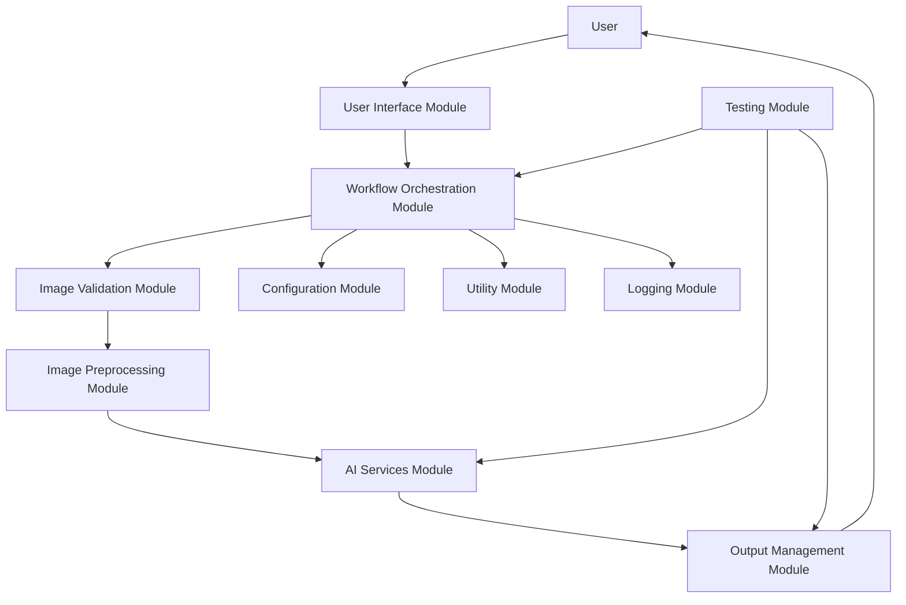
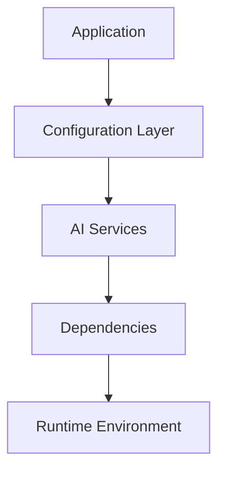
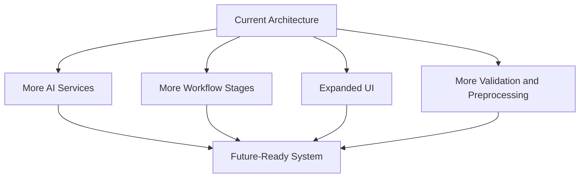

# Architecture

## 1. System Architecture Overview

FabricVision-AI is structured as a modular AI application that separates user interaction, image preparation, orchestration, and model execution into distinct responsibilities. This design supports maintainability, future extension, and clear collaboration between UI, AI, and engineering components. The architecture is intentionally layered so that the interface can evolve independently from the underlying AI pipeline, and so that future model integrations can be introduced without disrupting the overall system.

### 1.1 Architectural Goals

The architecture for FabricVision-AI is guided by the following principles:

- Separation of concerns: each subsystem is responsible for a clearly defined part of the workflow.
- Modular design: core functionality is grouped into focused modules rather than embedded in a single entry point.
- Extensibility: new garment categories, materials, or model-based features can be added with minimal structural change.
- Maintainability: the system remains readable and easier to test as it grows.
- Reliability: validation, error handling, and clear workflow boundaries reduce the likelihood of fragile integrations.

### 1.2 High-Level Component Structure

The application is organized around the following major layers:

| Layer | Responsibility | Notes |
| --- | --- | --- |
| User Interface | Collects user input, displays results, and manages the interaction flow | Currently implemented with Gradio Blocks |
| Orchestration Layer | Coordinates the end-to-end try-on workflow | Responsible for sequencing model execution and output handling |
| Preprocessing Module | Validates and prepares images for model inference | Ensures input quality and consistency |
| AI Services Layer | Hosts the garment generation and virtual try-on operations | Separates model-specific logic from the application workflow |
| Configuration and Utilities | Stores reusable settings, constants, and helper logic | Supports cleaner and less hardcoded implementation |
| Output Management | Stores and presents generated images to the user | Keeps results traceable and reusable |

### 1.3 Runtime Workflow

The application workflow follows a clear progression from user input to final output:

1. The user uploads a person image and a fabric design image.
2. The system collects garment-related preferences such as gender, type, size, and material.
3. The input is validated and prepared for AI processing.
4. The garment generation step transforms the fabric design into a garment image that reflects the requested category and material characteristics.
5. The virtual try-on step places the generated garment onto the person image in a visually coherent way.
6. The resulting image is presented to the user and can be downloaded for use.

At the current stage of development, the Gradio interface is present and the AI inference path remains a placeholder. The architecture is nevertheless designed to support the later integration of the FLUX Kontext and CatVTON stages without changing the core modular structure.

### 1.4 Model Responsibility Boundaries

The AI pipeline is intentionally divided into two distinct responsibilities:

- FLUX Kontext is responsible for generating a garment image from the uploaded fabric design while preserving the selected garment category and visual characteristics.
- CatVTON is responsible for applying that generated garment to the person image and creating a realistic try-on result.

This separation is important because it keeps the garment generation and final rendering concerns independent. It also makes future model replacement or improvement easier, since one stage can be updated without requiring a rewrite of the other.

### 1.5 Architectural Diagram

### 1.6 Design Summary

The architecture for FabricVision-AI is designed to be simple at the current stage of the project while remaining scalable for future development. It balances clarity and flexibility by separating user-facing concerns from AI execution logic and by keeping the workflow explicit and easy to extend. This foundation is suitable for continued development as the system transitions from a UI prototype toward a fully integrated inference pipeline.

## 2. Architectural Design Principles

Architectural principles are essential for FabricVision-AI because the system combines user interaction, image processing, AI inference, and future expansion into a single product experience. A well-defined architectural foundation ensures that the application remains understandable, resilient, and adaptable as the project grows from an early prototype into a more complete and production-oriented solution. These principles provide a shared engineering standard for how the system should be structured, evolved, and reviewed over time.

### 2.1 Modular Architecture

Modular architecture refers to organizing a system into distinct, purpose-driven components that can be developed and reasoned about independently. In a complex AI application, this principle is important because it prevents the system from becoming tightly interwoven and difficult to manage. FabricVision-AI follows this principle conceptually by treating the user interface, image preprocessing, AI service orchestration, and output handling as separate areas of responsibility. This approach makes the system easier to understand, test, and evolve as new capabilities are introduced. The long-term advantage is that future enhancements, such as new model integrations or interface improvements, can be implemented with less disruption to the rest of the application.

### 2.2 Separation of Concerns

Separation of concerns is the practice of dividing a system so that each part addresses a specific aspect of the application rather than handling multiple responsibilities at once. This principle is especially valuable in AI-driven systems, where the workflow often spans data preparation, model execution, user interaction, and result presentation. FabricVision-AI follows this principle by keeping its functional responsibilities conceptually distinct across the user experience, processing stages, and AI workflow. The benefit is greater clarity in design, reduced risk of unintended side effects, and a stronger foundation for future refinement. Over time, this also improves collaboration among developers and AI engineers because each subsystem has a more predictable purpose.

### 2.3 Single Responsibility Principle

The Single Responsibility Principle states that a module or component should have one primary reason to change. This principle is important because AI systems often evolve in multiple directions at once, and a component that handles too many responsibilities becomes brittle and harder to maintain. FabricVision-AI follows this principle conceptually by ensuring that each major area of the system is centered around a specific responsibility, such as input handling, pipeline coordination, or output presentation. The long-term benefit is that changes in one part of the system are less likely to cascade into unrelated parts, making the project easier to evolve safely.

### 2.4 Loose Coupling and High Cohesion

Loose coupling and high cohesion describe a design in which components depend on each other minimally while remaining internally focused and consistent. This principle is important because it helps prevent fragile relationships between subsystems and encourages designs that are easier to replace or improve. FabricVision-AI conceptually follows this principle by keeping the user experience, orchestration logic, and AI model responsibilities as distinct layers rather than forcing them into a single tightly connected structure. The long-term advantage is that individual components can be upgraded, tested, or swapped without creating widespread architectural instability.

### 2.5 Scalability

Scalability refers to the ability of a system to handle increasing complexity, users, data volume, or feature scope without losing performance or clarity. For FabricVision-AI, this principle is important because the application is expected to grow from an initial proof-of-concept into a richer AI workflow with more models, more input options, and more production requirements. The project follows this principle conceptually by structuring the system in a way that can support additional processing stages, additional model integrations, and more advanced orchestration over time. The long-term benefit is that the application can evolve without requiring a complete redesign every time new functionality is introduced.

### 2.6 Maintainability

Maintainability is the ability of a system to be understood, updated, and corrected efficiently over time. This principle matters greatly in AI-based products because model behavior, data assumptions, and user requirements can change as the project matures. FabricVision-AI follows maintainability by emphasizing clear responsibility boundaries, structured workflow stages, and a documentation-oriented approach that keeps the system understandable for future contributors. The long-term advantage is reduced technical debt, faster onboarding for new developers, and more predictable development cycles as the project expands.

### 2.7 Extensibility

Extensibility is the capacity to add new features or capabilities without significantly restructuring the system. This principle is crucial for a project like FabricVision-AI, where future versions may introduce additional garment types, color controls, fabric categories, model variants, or improved workflow steps. The project follows this principle conceptually by keeping its overall design open to incremental growth rather than hardcoding all behavior into a single monolithic workflow. The long-term advantage is that new capabilities can be introduced in a controlled and organized way, preserving architectural stability while supporting innovation.

### 2.8 Reusability

Reusability means designing components and logic in a way that can be applied in multiple contexts rather than being duplicated for each use case. This is important in AI applications because many tasks share common behaviors such as input validation, image handling, configuration lookup, and workflow control. FabricVision-AI follows this principle conceptually by separating shared concerns into reusable functional areas that can support multiple stages of the pipeline and future UI or processing enhancements. The long-term advantage is reduced implementation effort, improved consistency, and a stronger foundation for future features that rely on similar capabilities.

### 2.9 Configuration-Driven Development

Configuration-driven development focuses on keeping system behavior adjustable through defined configurations rather than embedding too much logic or policy directly into implementation code. This principle is important because AI applications often depend on model settings, input expectations, workflow options, and environment-specific parameters that may evolve over time. FabricVision-AI follows this principle conceptually by treating important decisions as configurable concerns rather than hardcoded assumptions. The long-term advantage is greater flexibility, easier adaptation to different environments, and a simpler path to testing and refinement as the system matures.

### 2.10 Robust Error Handling

Robust error handling is the practice of designing systems to anticipate failures and respond in a controlled, understandable way. This is particularly important in AI workflows, where bad input, model failure, missing resources, or unexpected processing conditions can disrupt the user experience. FabricVision-AI follows this principle conceptually by treating reliability as a first-class architectural concern, ensuring that the workflow is designed to handle invalid input and processing issues gracefully rather than failing silently or unpredictably. The long-term advantage is improved trustworthiness, better user experience, and safer evolution as more complex model operations are introduced.

### 2.11 Logging and Observability

Logging and observability refer to the ability to capture meaningful information about the system’s behavior so that issues can be diagnosed and understood clearly. This is essential in AI applications because failures may occur at multiple layers, including input validation, model execution, and output generation. FabricVision-AI follows this principle conceptually by recognizing the need for structured visibility into workflow execution and system status as the application grows. The long-term advantage is that developers and reviewers can understand what happened during a run, trace issues more efficiently, and improve system quality over time.

### 2.12 AI Model Independence

AI model independence means that the application architecture should not be tightly bound to any single model implementation. This principle is important because AI models evolve rapidly, and different models may be better suited to different tasks, trade-offs, or performance goals over time. FabricVision-AI follows this principle conceptually by separating the garment generation and try-on steps into distinct functional concerns that can be represented by different model implementations in the future. The long-term advantage is greater flexibility, easier experimentation, and less risk when upgrading or replacing models.

### 2.13 Pipeline Isolation

Pipeline isolation refers to keeping the stages of a workflow distinct so that each step can be developed, tested, and improved independently. This is important in multi-stage AI systems because the output of one stage often becomes the input of another, and failures or changes in one stage should not cause unnecessary complications elsewhere. FabricVision-AI follows this principle conceptually by treating garment generation and virtual try-on as separate stages within the overall workflow. The long-term benefit is more controlled development, easier debugging, and stronger resilience when one step changes or needs optimization.

### 2.14 Documentation-First Development

Documentation-first development emphasizes treating documentation as a core part of the engineering process rather than an afterthought. This principle is important because AI projects often involve complex workflows, model responsibilities, and evolving requirements that must be clearly communicated to both humans and tools. FabricVision-AI follows this principle conceptually by maintaining structured documentation that explains the architecture, workflow, and design decisions in a way that supports future development. The long-term advantage is improved continuity, smoother collaboration, and a stronger basis for onboarding, review, and sustained evolution.

### 2.15 Summary Table

| Principle | Purpose | Benefit to FabricVision-AI |
| --- | --- | --- |
| Modular Architecture | Organizes the system into focused components | Improves clarity and makes future expansion easier |
| Separation of Concerns | Separates different responsibilities into distinct areas | Reduces cross-functional complexity and confusion |
| Single Responsibility Principle | Keeps each component focused on one main purpose | Makes changes safer and less disruptive |
| Loose Coupling and High Cohesion | Reduces dependencies while keeping related logic together | Improves flexibility and maintainability |
| Scalability | Supports growth in features and complexity | Helps the system evolve into a broader product |
| Maintainability | Supports long-term readability and ease of updates | Reduces technical debt and improves collaboration |
| Extensibility | Enables addition of new features without major restructuring | Supports future enhancements and innovation |
| Reusability | Encourages shared logic and common patterns | Reduces duplication and improves consistency |
| Configuration-Driven Development | Keeps behavior adaptable through settings and parameters | Improves flexibility and easier refinement |
| Robust Error Handling | Ensures failures are managed predictably | Enhances reliability and user trust |
| Logging and Observability | Makes system behavior inspectable and diagnosable | Speeds up debugging and quality improvement |
| AI Model Independence | Avoids locking the system to one model implementation | Enables model upgrades and experimentation |
| Pipeline Isolation | Keeps workflow stages independent and testable | Improves debugging and staged development |
| Documentation-First Development | Treats documentation as a foundational engineering asset | Supports continuity, onboarding, and long-term growth |

These principles provide a strong foundation for building FabricVision-AI as a scalable, maintainable, and production-quality AI application. By aligning the system with clear architectural values, the project can evolve with confidence, reduce risk, and remain understandable as it grows in capability and complexity.

## 3. Software Module Architecture

FabricVision-AI is divided into software modules to ensure that each major responsibility is handled by a clearly defined architectural unit. This modular structure is important because the application combines multiple concerns, including user interaction, data validation, image preparation, AI execution, and result management. By organizing the system in this way, the architecture remains understandable, easier to evolve, and better suited for future growth. Modularization also improves testing, reduces coupling between concerns, and allows different parts of the system to be developed or refined independently.

### 3.1 User Interface Module

The User Interface Module is the presentation and interaction layer of the application. Its purpose is to provide an intuitive experience for users who upload images, select garment preferences, and review generated results. This module is responsible for collecting user input such as person images, fabric design images, gender, garment type, size, material, pattern, and color preferences. It also presents the output to the user in a clear and accessible form. In the current architecture, this module is represented by the Gradio-based interface, which acts as the primary boundary between the end user and the underlying workflow. The User Interface Module communicates with the workflow pipeline by passing collected input into the orchestration flow and later receiving results for display. Its role is not to perform AI reasoning directly, but to ensure that the user experience remains consistent, structured, and easy to understand.

### 3.2 Workflow Orchestration Module

The Workflow Orchestration Module exists to coordinate the end-to-end sequence of operations that transform user inputs into final output. Its purpose is to manage the flow of execution across the application rather than to perform domain-specific tasks itself. This separation is important because the UI should remain focused on interaction, while orchestration should remain focused on sequencing and control. The orchestrator is responsible for deciding the order in which tasks occur, ensuring that each processing stage begins only when the required data is available, and passing information between modules in a controlled manner. It plays a central role in coordinating the complete AI pipeline, from initial input to final result generation. As the system grows, this module becomes the natural place to introduce additional workflow steps, conditional logic, and future multi-stage processing without burdening the interface or the AI services themselves.

### 3.3 Image Validation Module

The Image Validation Module is responsible for ensuring that incoming images satisfy the expectations required for reliable AI processing. Image validation is necessary because AI systems are highly sensitive to input quality, format consistency, and missing or malformed data. This module performs checks such as confirming that images are present, readable, and of an acceptable type and size, and it helps ensure that the input data is meaningful before any model processing begins. Validation is important before AI inference because poor-quality inputs can cause unstable behavior, misleading results, or unnecessary processing failures. By separating validation from downstream processing, the system improves reliability and prevents invalid data from propagating into more expensive or more fragile stages of the pipeline.

### 3.4 Image Preprocessing Module

The Image Preprocessing Module is responsible for preparing validated images for the AI pipeline. Its purpose is to transform raw input into a standardized form that is appropriate for downstream model consumption. This may include formatting, normalization, resizing, alignment, or other preparation steps that make the image consistent with the expectations of the processing workflow. Preprocessing is separated from validation because validation focuses on correctness and readiness, whereas preprocessing focuses on transformation and standardization. This separation is valuable because it allows the system to distinguish between whether input data is acceptable and how it should be prepared for effective inference. The result is a cleaner pipeline where each stage has a defined responsibility and where future model changes can be accommodated more easily.

### 3.5 AI Services Module

The AI Services Module manages all interactions with the AI models used by the application. Its purpose is to isolate model-specific logic from the rest of the system so that the application can treat AI operations as services rather than embedding model behavior throughout the architecture. This module contains the conceptual responsibilities for the FLUX Kontext Service and the CatVTON Service.

The FLUX Kontext Service is responsible for generating the garment image from the uploaded fabric design while preserving the requested garment characteristics and visual properties. Its role is focused on garment synthesis and design preservation, ensuring that the output aligns with the user’s selected material, pattern, and garment category. The CatVTON Service, by contrast, is responsible for applying the generated garment to the person image and creating the final try-on visualization. Its concern is realism, pose preservation, and image composition rather than fabric design generation.

Keeping model-specific logic isolated is essential because AI models are often specialized, evolving, and subject to different requirements. When model behavior is confined to a dedicated service layer, the rest of the application remains stable even if one model is upgraded, replaced, or expanded. This separation also improves maintainability, supports testing, and makes it easier to introduce future model alternatives without disrupting the broader architecture.

### 3.6 Pipeline Management Module

The Pipeline Management Module is responsible for the end-to-end coordination of the full AI workflow. It governs the movement of data from input acquisition to intermediate processing and final output generation. Its responsibilities include managing the flow of information between stages, maintaining the execution order of the pipeline, and ensuring that each stage receives the expected inputs and produces the proper outputs. This module also plays a key role in propagating errors and status information throughout the workflow so that failures can be handled systematically rather than causing ambiguous behavior. In a more advanced system, this module would support multiple stages, branching logic, and future multi-model support where different AI services may be selected or combined according to the task. By treating the pipeline as a managed architectural unit, the system can evolve into a more flexible and scalable processing environment.

### 3.7 Configuration Module

The Configuration Module provides centralized management for the settings and parameters that influence the system’s behavior. Its purpose is to prevent important values from being scattered across the codebase and to ensure that configuration remains consistent and maintainable. This includes environment settings, model-related paths, constants, workflow parameters, and other values that define how the application behaves. Configuration should never be hardcoded because hardcoded values reduce flexibility, complicate testing, and make it difficult to adapt the system to different environments or future changes. A centralized configuration approach improves clarity, supports safer updates, and enables the application to evolve without introducing unnecessary brittleness.

### 3.8 Utility Module

The Utility Module provides shared, reusable functionality that supports multiple parts of the application without being tied to any single business concern. Its purpose is to centralize generic capabilities such as helper functions, file operations, image utilities, and common logic that may be required by several modules. Utilities should remain generic so that they can support broad use cases rather than becoming specialized to one workflow step. This helps maintain consistency while reducing duplication and the risk of inconsistencies between modules. By keeping generic functionality in a dedicated utility layer, the architecture becomes easier to extend and less prone to unnecessary complexity.

### 3.9 Logging Module

The Logging Module is responsible for recording and exposing system activity in a way that supports monitoring, debugging, and operational awareness. Its purpose is to capture meaningful events throughout the workflow so that developers can understand what happened during processing, where a failure occurred, and what state the system was in at the time. In an AI application, logging is especially important because failures or anomalies may arise across multiple stages, from input handling to model execution and output management. The Logging Module supports this by providing a consistent way to record important events, errors, and status changes. Over time, this becomes the foundation for more advanced production monitoring, diagnostics, and operational oversight.

### 3.10 Output Management Module

The Output Management Module is responsible for organizing and presenting the results produced by the pipeline. Its responsibilities include generated image storage, file organization, preview preparation, and download readiness. This module ensures that generated outputs are handled in a structured and reusable way rather than being treated as temporary side effects of the AI process. Keeping output handling independent from AI inference is important because the two concerns are conceptually different: inference creates the result, while output management ensures that the result is preserved, delivered, and presented appropriately. This separation improves clarity, makes result handling easier to manage, and supports future enhancements such as richer output browsing or additional artifact generation.

### 3.11 Testing Module

The Testing Module exists to ensure that the system behaves correctly and remains reliable as it evolves. Its purpose is to support both unit testing, which validates isolated logic, and integration testing, which checks that modules interact correctly as a system. In the context of FabricVision-AI, testing is especially important because the application involves multiple stages and AI-dependent behavior that can be difficult to validate manually. By treating testing as a separate architectural concern, the project can validate individual modules independently while also verifying the end-to-end workflow. This supports quality assurance, reduces regression risk, and provides a structured foundation for future AI pipeline validation as the system becomes more advanced.

### 3.12 Module Relationship Diagram

### 3.13 Module Dependency Table

| Module | Primary Responsibility | Depends On | Used By |
| --- | --- | --- | --- |
| User Interface Module | Collects user input and presents results | Workflow Orchestration Module, Configuration Module | User |
| Workflow Orchestration Module | Coordinates the end-to-end pipeline | Configuration Module, Utility Module, Logging Module | User Interface Module, Pipeline Management Module |
| Image Validation Module | Ensures input images are acceptable for processing | Utility Module, Configuration Module | Workflow Orchestration Module |
| Image Preprocessing Module | Prepares images for AI processing | Image Validation Module, Utility Module | Workflow Orchestration Module |
| AI Services Module | Executes model-specific processing tasks | Configuration Module, Utility Module, Logging Module | Workflow Orchestration Module |
| Pipeline Management Module | Manages execution flow and stage transitions | Workflow Orchestration Module, AI Services Module | Workflow Orchestration Module |
| Configuration Module | Centralizes application settings and parameters | None | All modules |
| Utility Module | Provides shared supporting functionality | None | All modules |
| Logging Module | Records system events and diagnostics | Configuration Module | All modules |
| Output Management Module | Stores and presents generated outputs | Utility Module, Configuration Module | Workflow Orchestration Module, AI Services Module |
| Testing Module | Validates correctness at unit and integration levels | All modules | Development and quality assurance |

### 3.14 Design Summary

This modular architecture was chosen because FabricVision-AI is inherently multi-stage and multi-concerned. The application must manage user interaction, input quality, image preparation, AI services, result delivery, and long-term maintainability within a single coherent system. By dividing these concerns into explicit modules, the architecture supports future AI model replacement, improves maintainability, and enables independent development and testing. It also provides a strong foundation for scalability, because new processing stages, new models, or new user-facing capabilities can be integrated with less disruption. In this way, the modular design helps the project remain organized, adaptable, and suitable for continued evolution as a production-quality AI application.

## 4. Project Directory Architecture

The project directory structure exists to reinforce the architectural boundaries of FabricVision-AI rather than merely organize files by convenience. A carefully defined directory layout improves clarity, helps isolate responsibilities, and makes it easier for developers to understand where different kinds of assets, source code, documentation, and outputs belong. In a multi-stage AI application, this organization is particularly important because the system must balance interface concerns, model-related artifacts, training or reference data, generated outputs, and supporting documentation in a way that remains maintainable as the project evolves.

### 4.1 Architectural Purpose of the Directory Structure

The directory architecture serves several important roles:

- It creates a clear separation between application code, supporting assets, generated outputs, and documentation.
- It reduces the risk of mixing source artifacts with runtime outputs or model-specific resources.
- It makes the codebase easier to navigate for both current contributors and future maintainers.
- It provides a stable framework for scaling the application as more components and datasets are introduced.

This arrangement encourages separation of concerns at the repository level, which complements the modular architecture of the application itself.

### 4.2 Major Directories and Their Architectural Roles

#### assets/

The assets directory exists to hold static resources that support the application experience, such as icons, logo files, and demo images. Its purpose is to separate reusable visual assets from the software source code so that interface presentation and branding remain distinct from the executable logic of the application. This helps protect the architecture from becoming cluttered with media files that are not part of the business logic.

#### datasets/

The datasets directory contains reference data and domain-specific image collections used by the application context. Its architectural purpose is to separate training-related or supporting data resources from the operational codebase. By isolating data in a dedicated area, the project maintains a cleaner distinction between the application runtime and the assets that inform or support its AI workflows.

#### docs/

The docs directory serves as the architectural and technical documentation home for the project. Its purpose is to preserve knowledge about system design, workflow expectations, and future development direction in a location that is independent from the functional code. This supports maintainability, onboarding, and long-term continuity because the system’s rationale is captured in a structured and accessible place.

#### models/

The models directory is reserved for model-related content and supporting components that are integral to the AI workflow. Its architectural purpose is to keep model assets and associated resources distinct from the application source and from generated output files. This separation is valuable because model artifacts often have different lifecycle concerns, dependencies, and update patterns than the application code itself.

#### outputs/

The outputs directory exists to store generated artifacts produced during the application workflow. Its purpose is to keep runtime or inference results separate from source code, datasets, and documentation. This helps maintain a clean repository structure and supports the long-term need to manage generated content in a controlled way. By isolating outputs, the architecture also improves traceability and reduces the chance that generated files interfere with the codebase.

#### src/

The src directory is the primary home for the application’s structured source code. Its architectural purpose is to encapsulate the logical implementation of the system in a dedicated location that is clearly distinct from supporting assets, datasets, and generated outputs. This separation reinforces the application’s modular design and allows the software to grow without mixing source concerns with non-source resources.

#### tests/

The tests directory exists to provide a dedicated place for validation activities. Its purpose is to keep verification artifacts separate from the application implementation so that testing remains an explicit architectural concern. This supports maintainability, quality assurance, and regression prevention as the system evolves.

### 4.3 Root Files and Their Architectural Significance

#### app.py

The root application entry point exists to provide a clear launch location for the system. Its architectural role is to initiate the user-facing application in a predictable way while keeping the startup logic separate from the deeper application modules. This helps preserve a clean boundary between entry-point concerns and implementation details.

#### requirements.txt

The requirements file defines the project’s declared dependencies in a centralized and explicit manner. Its purpose is to make the runtime environment reproducible and easier to manage. By keeping dependencies in a dedicated file, the project improves portability, onboarding, and environment consistency.

#### README.md

The README acts as the primary project overview and entry point for human readers. Its architectural value lies in providing contextual information about the system’s purpose, structure, and expected usage without embedding that knowledge in the source code itself. This improves developer experience and helps maintain continuity across contributors.

#### .gitignore

The git ignore configuration ensures that temporary files, generated artifacts, and other non-source content do not clutter the repository. Its architectural purpose is to preserve the cleanliness of the codebase and to distinguish between source-controlled content and working artifacts. This supports maintainability and makes the repository easier to manage during development and testing.

### 4.4 How the Directory Organization Supports Architectural Goals

The directory organization contributes directly to the project’s architectural quality:

- Maintainability: developers can find the right type of content quickly and avoid mixing responsibilities.
- Scalability: new modules, datasets, or generated outputs can be added without disrupting the existing structure.
- Reusability: shared assets and documentation are stored in clearly defined locations that support reuse across the system.
- Separation of Concerns: source code, data, outputs, and documentation remain distinct and easier to reason about.
- Developer Experience: the repository is easier to navigate, understand, and extend over time.

### 4.5 Directory Responsibility Table

| Directory | Purpose | Primary Responsibility |
| --- | --- | --- |
| assets/ | Stores static interface and visual support files | Visual resources and presentation support |
| datasets/ | Holds reference and domain-specific data resources | Data support and domain context |
| docs/ | Contains architecture and project documentation | Knowledge and design documentation |
| models/ | Stores model-related assets and dependencies | AI model resources |
| outputs/ | Keeps generated results and runtime artifacts | Result storage and artifact management |
| src/ | Contains the application’s source code | Core implementation and module organization |
| tests/ | Stores validation and verification assets | Quality assurance and regression testing |

### 4.6 Design Summary

This directory organization supports long-term development by keeping the project structured around clear architectural responsibilities. It allows the system to grow without becoming disorganized, and it reinforces the broader design principles of separation of concerns, modularity, and maintainability. As FabricVision-AI expands, this layout provides a stable foundation for adding new features, integrating new models, and managing project artifacts in a consistent and professional way.

## 5. AI Pipeline Architecture

The AI pipeline architecture of FabricVision-AI describes the structured flow of work from user input to final output. This pipeline is important because it transforms a sequence of user choices and uploaded images into a coherent AI-driven result while preserving separation between distinct processing stages. A staged architecture is particularly valuable in an AI application because each step has a different purpose, different input requirements, and different risks. By organizing the workflow into explicit stages, the system remains easier to manage, test, and evolve over time.

### 5.1 Pipeline Overview

The pipeline begins when the user provides input to the application and ends when the final try-on result is displayed and prepared for download. Each stage contributes a specific role in the transformation process:

1. User Input
2. Image Validation
3. Image Preprocessing
4. Workflow Orchestration
5. FLUX Kontext
6. Generated Garment
7. CatVTON
8. Output Management
9. User Preview
10. Download

This staged design ensures that responsibility is distributed across the architecture rather than concentrated in a single monolithic process.

### 5.2 Stage-by-Stage Architecture

#### 5.2.1 User Input

The User Input stage collects the information required to initiate the virtual try-on workflow. This includes the person image, the fabric design image, and the user’s selected garment preferences such as gender, type, size, material, and color. Its purpose is to translate human intent into structured input for the system. The input produced by this stage is then passed to the validation and orchestration layers for further handling.

#### 5.2.2 Image Validation

The Image Validation stage examines the uploaded images to ensure they are acceptable for downstream AI processing. Its purpose is to confirm that the inputs are present, readable, and suitable for the workflow. The output of this stage is a validated set of images that can proceed to preparation. This stage is essential because invalid or low-quality input can lead to unreliable results or unnecessary downstream failures.

#### 5.2.3 Image Preprocessing

The Image Preprocessing stage transforms validated images into a standardized form appropriate for AI processing. Its purpose is to improve consistency and prepare the data for model interaction. The output of this stage is normalized input data ready for the orchestration and inference layers. This stage is separated from validation because validation focuses on readiness, whereas preprocessing focuses on transformation.

#### 5.2.4 Workflow Orchestration

The Workflow Orchestration stage manages the execution sequence of the pipeline. Its purpose is to coordinate the movement of data between stages and ensure that each step is executed in the correct order. It receives the prepared input and supervises the progression from initial processing to final output handling. This stage is critical because it prevents the pipeline from becoming a loosely connected set of operations and instead turns it into a coherent system of dependent stages.

#### 5.2.5 FLUX Kontext

FLUX Kontext represents the garment-generation stage of the pipeline. Its purpose is to transform the uploaded fabric design into a garment image that reflects the requested garment category, visual style, and material identity. The input to this stage is the validated and preprocessed fabric design together with the user’s selected garment-related preferences. The output is a generated garment image that serves as the basis for the next stage. This stage is important because it creates the garment artifact that will be visually applied to the person image later in the pipeline.

#### 5.2.6 Generated Garment

The Generated Garment stage is the intermediate product of the garment synthesis workflow. Its purpose is to provide a structured output that can be handed to the downstream try-on stage. The generated garment is not the final application result, but it is a critical intermediate artifact that carries the design intent and visual characteristics produced by FLUX Kontext. Its role is to bridge the design-generation stage and the rendering stage without forcing the two concerns to be merged into one process.

#### 5.2.7 CatVTON

CatVTON represents the virtual try-on stage of the pipeline. Its purpose is to place the generated garment onto the person image in a realistic and visually coherent way. The input to this stage is the person image and the generated garment image. The output is the final try-on result. This stage is conceptually independent from FLUX Kontext because it focuses on rendering and fitting rather than garment creation. The separation is essential because it allows the architecture to treat garment generation and garment application as distinct responsibilities.

#### 5.2.8 Output Management

The Output Management stage handles the result produced by the virtual try-on process. Its purpose is to organize, preserve, and prepare the generated image for presentation and future use. This stage ensures that the final output is stored or represented in a controlled manner rather than being left as an unstructured intermediate artifact. It is responsible for keeping the final result accessible to the user and consistent with the rest of the system’s output conventions.

#### 5.2.9 User Preview

The User Preview stage provides the final result to the user in a readable and understandable form. Its purpose is to make the generated image visible in the application experience so that the user can review the result. This stage depends on the output produced by the pipeline and is responsible for presenting that result clearly. It acts as the visible endpoint of the processing workflow.

#### 5.2.10 Download

The Download stage is the final consumption point for the generated result. Its purpose is to provide the user with a way to retrieve the final output for reuse outside the application. This stage is important because it turns the processed result into a deliverable artifact that can be saved and shared. It also reinforces the architectural principle that the application should separate the creation of an output from its final presentation and dissemination.

### 5.3 Why FLUX Kontext and CatVTON Are Independent Stages

FLUX Kontext and CatVTON are independent pipeline stages because they address different problems within the overall try-on workflow. FLUX Kontext is responsible for generating the garment concept from the fabric design input, while CatVTON is responsible for applying that garment to the human image. These are distinct tasks that require different modeling concerns, different data expectations, and different quality objectives. Keeping them as independent stages makes the architecture more modular, easier to evolve, and more resilient to model-specific changes. If one stage changes, the other can remain stable, which is a major advantage for future model upgrades or experimentation.

### 5.4 Architectural Advantages of a Staged AI Pipeline

A staged pipeline provides several important advantages:

- Clear responsibility boundaries between each processing step.
- Easier debugging because failures can be localized to a specific stage.
- Greater flexibility for future model replacements or workflow changes.
- Improved maintainability because each stage can be refined independently.
- Better testing because intermediate outputs can be validated at each boundary.

This kind of architecture is especially suitable for AI systems that involve multiple specialized operations rather than a single end-to-end transformation.

### 5.5 AI Pipeline Diagram

### 5.6 Stage Summary Table

| Stage | Purpose | Input | Output |
| --- | --- | --- | --- |
| User Input | Collects user selections and uploaded images | User choices and image files | Structured request data |
| Image Validation | Confirms input quality and readiness | Raw uploaded images | Validated input |
| Image Preprocessing | Standardizes images for AI consumption | Validated images | Prepared images |
| Workflow Orchestration | Coordinates the processing sequence | Prepared input and workflow state | Controlled execution flow |
| FLUX Kontext | Generates the garment image | Fabric design and garment preferences | Generated garment |
| Generated Garment | Provides the intermediate garment artifact | Garment output from FLUX | Intermediate garment result |
| CatVTON | Applies the garment to the person image | Person image and generated garment | Final try-on result |
| Output Management | Organizes and preserves the result | Final try-on result | Managed output artifact |
| User Preview | Presents the final image to the user | Managed output artifact | Visible result |
| Download | Makes the result available outside the application | Final output artifact | Downloadable result |

### 5.7 Design Summary

The AI pipeline architecture is designed to make the system understandable, modular, and extensible. By separating the workflow into well-defined processing stages, FabricVision-AI can support future upgrades, model changes, and more advanced orchestration without sacrificing clarity or reliability.

## 6. Data Flow Architecture

Understanding data flow is essential in FabricVision-AI because the application is not just a single interface or a single model; it is a coordinated system that moves user input, images, parameters, intermediate artifacts, and final results through multiple stages. A clear data flow architecture helps developers understand how information is created, transformed, handed off, and ultimately consumed. It also improves debugging, testing, and maintainability by making the movement of data explicit rather than implicit.

### 6.1 Why Data Flow Matters

Data flow architecture provides a conceptual map of how information moves through the system. In a multi-stage AI application, this matters because each stage depends on the output of the previous one. If the flow of information is poorly controlled, the system becomes harder to understand, test, and evolve. In FabricVision-AI, controlled data movement ensures that user inputs become valid, processed, and usable by the AI services, while outputs remain organized and available to the end user. This discipline is a core part of the system’s maintainability and architectural robustness.

### 6.2 Major Data Flow Steps

#### 6.2.1 User Input Flow

The user input flow begins when the user interacts with the interface and provides the data required for generation. This includes uploaded images and multiple user selections that describe the intended garment and style. The data is produced by the User Interface Module and passed to the workflow layer for further processing. At this point, the data is still unvalidated and should be treated as raw input that requires structure and quality checks.

#### 6.2.2 Validation Flow

The validation flow is responsible for checking the incoming data before it reaches the AI stages. The Image Validation Module consumes the raw input data and evaluates whether it is present, readable, and suitable for the workflow. If validation succeeds, the data is forwarded onward as validated input. If not, the system can halt or report the issue in a controlled way. This step is crucial because it prevents lower-level processing stages from receiving data that is incomplete or unusable.

#### 6.2.3 Preprocessing Flow

Once the data has been validated, the preprocessing flow transforms it into a standardized form. The Image Preprocessing Module consumes the validated input and produces prepared image data that is more consistent with the expectations of downstream AI services. This flow is essential because AI workflows often require consistent input characteristics to operate predictably. The output of this stage becomes the structured input for the main processing pipeline.

#### 6.2.4 AI Processing Flow

The AI processing flow is the central transformation path of the system. The Workflow Orchestration Module coordinates the movement of preprocessed data into the AI Services Module, where the garment-generation and virtual try-on operations are performed. The FLUX Kontext stage consumes the fabric-related input and produces a garment artifact, while CatVTON consumes the person image and the generated garment to produce the final try-on result. This flow demonstrates how data is progressively transformed from raw user input into a richer and more specialized output.

#### 6.2.5 Output Flow

The output flow begins once the AI processing stage has produced a result. The Output Management Module consumes the generated image and organizes it so that it can be previewed and delivered to the user. This stage is responsible for preserving the final artifact in a structured way and making it available to the presentation layer. The output flow ensures that the result of the pipeline is not left in an ambiguous or transient state.

#### 6.2.6 Error Flow

The error flow is the path by which issues and failures are reported through the system. When a stage cannot process the data as expected, the error is captured and propagated through the workflow in a controlled manner. This may involve logging, status updates, or a graceful interruption of the pipeline. Error flow is important because it allows the system to maintain predictability and transparency even when a stage fails. It also prevents errors from being silently ignored or causing cascading failures in unrelated modules.

### 6.3 Module-to-Module Data Movement

The data flow architecture is designed so that each module receives data from a preceding stage and forwards a transformed or refined artifact to the next. This controlled movement of information is important because it preserves the integrity of the workflow and limits unnecessary coupling between modules. In this architecture, the User Interface Module produces input data, the validation layer checks it, preprocessing standardizes it, the orchestration layer coordinates it, AI services transform it, and the output module presents the result. Each module operates on well-defined data responsibilities rather than sharing uncontrolled state across the system.

### 6.4 Why Controlled Data Movement Improves Debugging and Maintainability

A modular data flow improves debugging because each stage produces a clear and inspectable artifact. If an issue emerges, developers can trace the pipeline at the point where the data deviates from expectations. It also improves maintainability because changes to one stage can be made with a better understanding of the data that stage consumes and produces. The system becomes easier to evolve because the flow of information is explicit, predictable, and bounded by module responsibilities.

### 6.5 Data Flow Diagram

### 6.6 Data Flow Summary Table

| Flow | Producer | Consumer | Purpose |
| --- | --- | --- | --- |
| User Input Flow | User Interface Module | Workflow Orchestration Module | Transfers user choices and uploaded images into the system |
| Validation Flow | Image Validation Module | Image Preprocessing Module | Confirms that input data is acceptable for processing |
| Preprocessing Flow | Image Preprocessing Module | Workflow Orchestration Module / AI Services Module | Standardizes data for downstream model use |
| AI Processing Flow | Workflow Orchestration Module / AI Services Module | Output Management Module | Transforms input into generated results |
| Output Flow | Output Management Module | User Interface Module | Makes results available for preview and download |
| Error Flow | Any processing stage | Logging Module / Workflow Orchestration Module | Captures and propagates failures in a controlled way |

### 6.7 Design Summary

The data flow architecture of FabricVision-AI is designed to minimize coupling while maintaining a predictable and scalable movement of information across the system. By treating data as a carefully managed resource that moves through clearly defined stages, the architecture remains easier to debug, easier to evolve, and better suited for future growth as the application becomes more sophisticated.

## 7. AI Model Responsibilities

The AI model responsibilities in FabricVision-AI are intentionally separated because the system is designed around a multi-stage generation and rendering workflow rather than a single monolithic inference process. This separation is architectural rather than incidental: garment generation and virtual try-on address different goals, require different reasoning, and should therefore remain conceptually independent. By assigning distinct responsibilities to different AI models, the application becomes easier to reason about, easier to evolve, and more resilient to change as the project grows. This approach also supports experimentation, model replacement, and long-term maintainability without forcing the entire application to depend on a single model-specific design.

### 7.1 FLUX Kontext

FLUX Kontext serves as the garment-generation stage of the architecture. Its primary responsibility is to transform the uploaded fabric design into a garment representation that reflects the requested garment category, material characteristics, and visual intent. In architectural terms, this model is responsible for design synthesis rather than final human rendering. Its inputs are the fabric design image and the selected garment-related preferences that guide the generation request. Its output is a generated garment image that represents the intended clothing concept. Within the broader pipeline, FLUX Kontext acts as the first major AI transformation stage, producing the garment artifact that will later be consumed by the try-on stage. Its expected behavior is to preserve the visual identity of the uploaded fabric while producing a coherent garment form that aligns with the selected category. It should remain architecturally bounded to garment creation and should not be responsible for pose fitting, human placement, or final visual integration. This separation is important because it preserves clear responsibilities and allows future improvements to garment generation without overlapping with the try-on stage. Over time, FLUX Kontext can be replaced, upgraded, or specialized without requiring the rest of the pipeline to change structurally.

### 7.2 CatVTON

CatVTON serves as the virtual try-on stage of the architecture. Its primary responsibility is to place the generated garment onto the person image in a visually coherent and realistic manner. Unlike FLUX Kontext, it is not tasked with creating the garment concept itself; instead, it focuses on rendering the garment onto the human subject and preserving the appearance of the body, pose, and general composition. Its inputs are the person image and the generated garment image produced by the previous stage. Its output is the final try-on result. Within the pipeline, CatVTON functions as the second major AI stage, taking the intermediate garment output and turning it into a completed visual result. Its expected behavior is to preserve human proportions, fit, and clothing placement in a way that makes the result believable. Its architectural boundaries should remain focused on try-on rendering rather than garment generation, and it should operate independently from the design synthesis concerns handled by FLUX Kontext. This separation enables future replacement or refinement of the try-on stage without requiring changes to the upstream garment-generation logic.

### 7.3 Model Interaction

FLUX Kontext and CatVTON interact through a well-defined handoff of intermediate output. The first model produces a garment artifact, and that artifact becomes the input to the second model. This handoff should be treated as an architectural boundary rather than a tightly coupled integration point. Direct coupling should be avoided because it would make the system more fragile, less modular, and less adaptable to changes in model behavior or model selection. Service abstraction is important because it allows the application to treat each AI model as a distinct processing capability with a stable interface, even if the underlying implementation changes over time. This improves maintainability by keeping model-specific behavior isolated and by allowing the application to evolve without forcing the entire workflow to adapt to each model’s internal requirements. The separation also supports future experimentation, because one model can be improved or replaced while the rest of the architecture remains stable.

### 7.4 Model Responsibility Table

| Model | Purpose | Input | Output | Responsibility |
| --- | --- | --- | --- | --- |
| FLUX Kontext | Garment generation from fabric design | Fabric design image and garment preferences | Generated garment image | Design synthesis and garment creation |
| CatVTON | Virtual try-on rendering | Person image and generated garment image | Final try-on output | Garment placement and rendering |

### 7.5 Design Summary

Separating AI responsibilities creates a scalable AI architecture because each model can be developed, assessed, and evolved around a clearly defined purpose. This improves modularity, reduces coupling, and gives the system a stronger foundation for future model upgrades and workflow expansion.

## 8. Configuration & Dependency Architecture

Configuration and dependency architecture are essential in FabricVision-AI because AI applications depend on many variables that affect behavior, reproducibility, and system stability. Centralized configuration is important because it prevents critical values from being scattered across the system and makes the software more understandable and easier to manage. In an architecture intended to remain maintainable and extensible, configuration should be treated as a first-class concern rather than an incidental detail. This creates a clearer separation between business logic, environment-specific settings, and the external dependencies required for execution.

### 8.1 Purpose of Centralized Configuration

Centralized configuration serves several architectural purposes. It provides a single source of truth for settings that affect application behavior, it reduces the risk of inconsistent values across components, and it supports easier updates as the system grows. In FabricVision-AI, configuration is especially important because the application relies on inputs, model-related assumptions, runtime parameters, and environment-specific conditions that may change over time. A centralized configuration approach ensures that the architecture remains adaptable while avoiding hardcoded behavior that would reduce flexibility and increase maintenance effort.

### 8.2 Architectural Importance of Configuration in AI Software

Configuration management matters in AI software because the behavior of the system often depends on factors that are external to the core logic. Model paths, runtime parameters, and application constants may vary between environments, and these values must be manageable without changing the logical structure of the software. A strong configuration architecture makes the application more reproducible, easier to test, and more consistent across development and future operational environments. It also improves the system’s ability to evolve as new models, parameters, or workflow stages are introduced.

### 8.3 Core Configuration Concerns

#### Environment Variables

Environment variables represent one of the primary ways to provide external configuration without embedding values directly in application logic. They allow the system to adapt to different contexts while preserving architectural separation between runtime conditions and business logic.

#### Model Paths

Model paths and related references should be managed in a controlled configuration layer so that AI components can access the appropriate resources without introducing hidden dependencies. This improves clarity and supports future model upgrades.

#### Application Constants

Application constants define stable values that influence behavior across the architecture, such as supported categories or default runtime choices. These should be managed in a structured way so that they remain understandable and consistent.

#### Runtime Parameters

Runtime parameters define the dynamic conditions under which the application operates. By keeping these separate from the core logic, the architecture remains flexible and easier to refine over time.

#### External Dependencies

External dependencies represent the software libraries, frameworks, and model-related resources on which the application relies. These should be managed as part of a deliberate dependency architecture rather than being treated as incidental implementation details.

### 8.4 Dependency Architecture

Dependencies should remain isolated from business logic so that the application’s core architecture is not tightly coupled to specific libraries or runtime assumptions. This separation supports maintainability because updates to one dependency do not require broad changes to the overall application structure. It also improves clarity, because the architectural responsibilities of the system remain visible even as the technology stack evolves.

### 8.5 Version Compatibility and Dependency Management

Version compatibility is a significant architectural consideration in AI software because dependencies can change their behavior, constraints, or support expectations over time. A robust dependency architecture seeks to preserve compatibility, reduce friction during upgrades, and ensure that the project remains understandable as external technologies evolve. This is especially important when the application relies on model-related software, image processing capabilities, and supporting runtime libraries. The architecture should be designed so that dependency upgrades can be introduced in a controlled and predictable manner.

### 8.6 Why Configuration Should Not Be Hardcoded

Configuration should never be hardcoded because hardcoded values make the software less adaptable, harder to test, and more difficult to maintain. They also reduce clarity by embedding environment-specific or model-specific assumptions into the core application logic. A configuration-driven approach allows the system to evolve without requiring structural changes every time a parameter or dependency changes.

### 8.7 Configuration and Dependency Diagram

### 8.8 Dependency Summary Table

| Area | Architectural Role | Benefit |
| --- | --- | --- |
| Configuration | Centralizes important settings and parameters | Improves maintainability and consistency |
| Environment Variables | Provides external runtime flexibility | Supports portability and adaptability |
| Model Paths | Keeps model resources explicit and managed | Improves clarity and future upgrades |
| Application Constants | Preserves stable architectural values | Reduces ambiguity and drift |
| Runtime Parameters | Makes behavior adjustable without restructuring logic | Improves flexibility and testing |
| External Dependencies | Separates third-party requirements from core logic | Supports maintainability and upgradeability |
| Python Runtime | Provides the execution foundation | Supports reproducibility and compatibility |
| Project Dependencies | Establishes the software environment | Improves onboarding and consistency |

### 8.9 Design Summary

A strong configuration and dependency architecture supports maintainability, reproducibility, and long-term flexibility. By keeping settings and dependencies managed and separated from business logic, FabricVision-AI remains easier to evolve and more resilient to change.

## 9. Security & Validation Considerations

Security and validation considerations are architectural concerns in FabricVision-AI because the application processes user-provided images and generates outputs through multiple AI stages. Even without assuming authentication, databases, or network infrastructure, the system still needs to be designed to handle input safely, prevent corrupted or malformed data from disrupting the workflow, and maintain predictable behavior under stress or failure. These concerns are important because the application’s reliability depends on the integrity of the data entering and leaving the pipeline.

### 9.1 Input Validation

Input validation is a foundational architectural safeguard. It ensures that the application only proceeds when the data it receives is structurally and semantically acceptable for processing. In the context of FabricVision-AI, this means confirming that necessary inputs are present and that the workflow is not initiated with incomplete or invalid request data. Validation reduces the risk of downstream failures and helps keep the AI stages operating within expected assumptions.

### 9.2 Image Validation

Image validation is especially important because the pipeline depends on image-based inputs. The architecture should treat image validation as a necessary gate before AI processing begins. This includes confirming that the supplied images are present, readable, and suitable for the intended workflow. By validating images early, the system avoids propagating bad input into later stages that may be more costly or less tolerant of failure.

### 9.3 File Format Validation

File format validation ensures that the system only accepts input types that are meaningful for the intended workflow. This protects the architecture from unsupported or malformed file conditions and helps maintain consistency across the pipeline. It also reduces the chance that incompatible data is passed into the AI services.

### 9.4 Size Validation

Size validation helps ensure that input files remain within reasonable and expected limits. This is important because oversized or unexpectedly large inputs can place unnecessary strain on the processing pipeline and affect system stability. Size validation supports controlled resource usage and contributes to a more predictable application architecture.

### 9.5 Corrupted File Detection

Corrupted file detection is an architectural safeguard that prevents damaged or unreadable input from entering the processing flow. Detecting corruption early supports reliability and reduces the chance of confusing or inconsistent downstream behavior. It also helps the system fail gracefully when the input cannot be processed safely.

### 9.6 Error Handling

Error handling is essential to ensure that failures are managed predictably rather than silently or unpredictably. The architecture should be designed so that validation failures, processing interruption, or unexpected conditions do not create ambiguous states. A robust error-handling approach improves dependability and makes the system easier to diagnose.

### 9.7 Safe File Management

Safe file management ensures that the application handles uploaded or generated files in a controlled and predictable manner. This includes avoiding accidental overwrites, preserving clear output boundaries, and ensuring that the system does not treat temporary or intermediate artifacts as permanent resources without oversight. Safe file management supports reliability and long-term maintainability.

### 9.8 Output Validation

Output validation is important because the result of the pipeline must be checked before it is presented to the user. This architectural concern ensures that generated results are meaningful and that the system does not expose incomplete or invalid outputs. It also strengthens confidence in the quality and consistency of the final deliverable.

### 9.9 Controlled Resource Usage

Controlled resource usage is a critical design concern for AI applications because image processing and model inference can place significant demands on the system. The architecture should be built to avoid unnecessary processing, manage data flow carefully, and ensure that invalid input stops early rather than consuming excessive resources. This improves robustness and supports future scalability.

### 9.10 Graceful Failure

Graceful failure ensures that the system responds to problems in a controlled and understandable way. Rather than producing confusing behavior, the architecture should allow the pipeline to halt or report failure in a structured manner. This improves user trust, simplifies debugging, and strengthens the overall reliability of the application.

### 9.11 Logging for Diagnostics

Logging is an important architectural component of validation and safety because it provides traceability when issues occur. Logs allow the system, developers, or reviewers to understand what happened during execution and at which stage the failure occurred. This supports diagnostics and improves the maintainability of the application over time.

### 9.12 Future Security Expansion

The architecture should remain open to future security expansion without requiring a complete redesign. As the application evolves, additional safeguards may be introduced, but the core principles of validation, controlled failure, and careful resource handling remain relevant. This makes the system more robust and better prepared for future requirements.

### 9.13 Security and Validation Summary Table

| Consideration | Purpose | Architectural Benefit |
| --- | --- | --- |
| Input Validation | Confirms that required data is present and acceptable | Prevents downstream failures and improves reliability |
| Image Validation | Ensures incoming images are suitable for processing | Protects the AI pipeline from invalid content |
| File Format Validation | Restricts input to supported types | Improves consistency and reduces compatibility issues |
| Size Validation | Prevents excessive resource usage | Supports predictable system behavior |
| Corrupted File Detection | Detects unreadable or damaged data | Improves robustness and graceful failure |
| Error Handling | Manages failures in a controlled manner | Improves trustworthiness and debuggability |
| Safe File Management | Keeps generated and uploaded files organized and controlled | Improves maintainability and reliability |
| Output Validation | Confirms that outputs are meaningful before presentation | Improves quality and consistency |
| Controlled Resource Usage | Limits unnecessary processing demands | Supports scalability and stability |
| Graceful Failure | Handles failures without ambiguous outcomes | Improves user experience and diagnostics |
| Logging for Diagnostics | Records meaningful execution information | Improves maintainability and traceability |

### 9.14 Design Summary

Security and validation considerations strengthen FabricVision-AI by ensuring that the system handles input responsibly, behaves predictably under stress, and remains reliable as it grows in complexity. These architectural safeguards are foundational to producing a robust AI application.

## 10. Scalability & Future Expansion

FabricVision-AI has been designed with long-term growth in mind. The architecture is not limited to the current workflow of garment generation and virtual try-on; rather, it is structured to support continuous extension as the application evolves. Scalability is achieved by maintaining clear separation between user interaction, orchestration, preprocessing, AI services, output management, and supporting concerns. This modular foundation allows the system to expand in capability without requiring a complete redesign of the entire application.

### 10.1 Future AI Model Replacement

One of the most important architectural strengths of the system is that it is not tightly bound to any single model implementation. The separation of responsibilities between garment generation and virtual try-on makes it possible to replace or upgrade one stage without disrupting the other. This is valuable because AI models evolve rapidly, and future versions may offer better quality, better performance, or different specialization. The architecture supports this change by keeping model responsibilities conceptually isolated and by treating each model as a service-oriented capability.

### 10.2 Additional AI Models

The system is also prepared for the future addition of more AI models. As the project grows, it may become beneficial to introduce specialized models for other tasks, such as image enhancement, background refinement, garment style variation, or additional rendering stages. Because the architecture places orchestration and service boundaries around the AI logic, these additions can be introduced without collapsing the entire system into a monolithic workflow.

### 10.3 New Garment Categories

The architecture is extensible enough to support new garment categories as the project expands. This is possible because the workflow is organized around general stages rather than fixed, hardcoded behavior for a small set of clothing types. As the system matures, new categories can be represented as part of the broader input and generation model design without forcing major structural change.

### 10.4 Additional Fabric Types

The application can also evolve to support a wider range of fabric types and material characteristics. This is consistent with the project’s architectural emphasis on modularity and configurable behavior. The system can accommodate additional material definitions as the domain knowledge or feature set grows.

### 10.5 More Preprocessing Stages

The architecture supports the future addition of more preprocessing stages because validation and preparation are treated as distinct concerns rather than embedded in the AI services themselves. This makes it feasible to introduce new image handling steps, quality checks, or transformation stages as the pipeline evolves.

### 10.6 Future Workflow Stages

The design also supports additional workflow stages. As the product matures, it may be useful to add intermediate validation, post-processing, quality scoring, or output refinement steps. Because the architecture already distinguishes orchestration from the underlying services, new stages can be inserted into the workflow with less disruption.

### 10.7 UI Evolution

The user interface is also positioned to evolve without forcing a complete architectural rewrite. Since the UI is separated from the workflow and AI services, future enhancements to user experience, input controls, previews, and result presentation can be introduced independently. This supports long-term usability improvements without destabilizing the core system.

### 10.8 Performance Optimization

Performance optimization can be addressed at the architectural level by improving orchestration logic, refining stage boundaries, and introducing more selective processing where appropriate. Because the architecture emphasizes clear modular responsibilities, performance work can be targeted to specific stages rather than requiring broad changes across the entire application.

### 10.9 Improved Orchestration

The orchestration layer provides a natural place for future growth in workflow intelligence. As the project evolves, this layer can be extended to include richer control logic, conditional branching, more detailed error propagation, and better coordination between pipeline stages. This makes the architecture adaptable to increasing workflow complexity.

### 10.10 Future Deployment Possibilities

Although deployment is not the focus of the current architecture, the system is structured in a way that can support future deployment scenarios as the project matures. Because the application logic is separated from the interface and external concerns, the architecture remains adaptable to different execution environments over time.

### 10.11 Codebase Growth and Developer Collaboration

The current architecture is designed to support codebase growth and collaboration among multiple contributors. By preserving clear module boundaries and supporting documentation, the system remains understandable as more developers work on it. This is especially important for AI projects, where interdisciplinary knowledge and evolving requirements can otherwise make the codebase difficult to manage.

### 10.12 Testing Expansion

Scalability also includes the ability to expand testing. The architecture supports this by separating concerns in a way that allows unit and integration testing to scale alongside the system. As the project grows, more validation points can be introduced at each stage of the pipeline without requiring a redesign of the overall architecture.

### 10.13 Scalability Diagram

### 10.14 Future Expansion Summary Table

| Expansion Area | Architectural Benefit |
| --- | --- |
| AI Model Replacement | Supports model upgrades without broad restructuring |
| Additional AI Models | Enables specialization and workflow growth |
| New Garment Categories | Keeps the system adaptable to broader use cases |
| Additional Fabric Types | Supports domain growth without changing core structure |
| More Preprocessing Stages | Improves pipeline flexibility |
| Future Workflow Stages | Supports richer and more complex processing |
| UI Evolution | Allows user experience improvements without redesigning the core |
| Performance Optimization | Enables targeted improvements to specific stages |
| Improved Orchestration | Supports more intelligent workflow control |
| Codebase Growth | Keeps the system manageable as it expands |
| Testing Expansion | Supports broader validation and quality assurance |

### 10.15 Design Summary

The architecture of FabricVision-AI is intentionally structured to support sustainable long-term development. Its modular design, clear component boundaries, and staged workflow make it well suited to future growth, model evolution, and continued refinement.

## 11. Architectural Decisions & Trade-offs

Architectural decisions in FabricVision-AI reflect the project’s need to balance clarity, flexibility, and long-term maintainability. Each decision was made with the intention of supporting a modular and extensible system while acknowledging that every architectural choice introduces trade-offs. This section records the major decisions and the reasoning behind them in a structured way so that future contributors can understand the design intent behind the current architecture.

### 11.1 Why Python Was Selected

The decision to use Python as the primary language for the architecture reflects its suitability for AI-oriented software development, its broad ecosystem, and its strong alignment with the project’s model-driven workflow. The benefit is that the system can leverage a wide range of scientific and AI-related tools while maintaining a readable and widely understood development model. The trade-off is that language-level concerns such as performance optimization or strict runtime constraints may require additional attention as the project evolves. Future considerations include maintaining compatibility with the project’s dependency ecosystem and supporting continued growth in complexity.

### 11.2 Why Gradio Was Selected

Gradio was selected as the interface technology because it provides a straightforward way to support interactive image-based workflows and user-facing experimentation. Its benefit is a simple and accessible user experience layer that fits the current project scope. The trade-off is that the interface architecture may need to evolve as the application grows in sophistication or requires more advanced interaction patterns. Future considerations include the possibility of expanding the UI model while preserving separation from the core workflow architecture.

### 11.3 Why Modular Architecture Was Chosen

A modular architecture was chosen because FabricVision-AI involves multiple concerns that are better managed when separated into distinct responsibilities. The benefit is improved maintainability, clearer boundaries, and better support for future expansion. The trade-off is that modularization introduces additional architectural discipline and requires careful coordination between components. Future considerations include preserving these boundaries as the system grows and avoiding unnecessary coupling between modules.

### 11.4 Why FLUX Kontext and CatVTON Are Separated

The decision to separate FLUX Kontext and CatVTON reflects the need to isolate garment generation from try-on rendering. This separation provides clear model responsibilities, makes each stage easier to reason about, and allows future replacements or improvements without disrupting the rest of the pipeline. The trade-off is that the system must manage an intermediate handoff between stages. Future considerations include preserving the integrity of that handoff as the workflow becomes more sophisticated.

### 11.5 Why Workflow Orchestration Exists

Workflow orchestration exists to coordinate the sequence of operations across the application and keep the pipeline coherent. Its benefit is improved control, clearer execution order, and better management of dependencies between stages. The trade-off is that orchestration introduces additional complexity in the form of workflow state and coordination logic. Future considerations include expanding orchestration capabilities as new stages or conditional workflows are introduced.

### 11.6 Why Configuration Is Centralized

Configuration has been centralized to keep important settings and runtime values in a controlled and maintainable structure. The benefit is improved flexibility, consistency, and simpler adaptation to changing environments. The trade-off is that configuration management requires discipline to keep values organized and clearly documented. Future considerations include expanding the configuration model as the application grows in scope and complexity.

### 11.7 Why Logging Is Separated

Logging has been separated as a distinct architectural concern to support observability, diagnostics, and maintainability. Its benefit is better visibility into the behavior of the system during execution and easier issue diagnosis. The trade-off is that logging introduces additional design considerations around consistency and sensible information capture. Future considerations include expanding logging capabilities as the system becomes more operationally mature.

### 11.8 Why AI Services Are Isolated

AI services are isolated so that model-specific logic does not spread throughout the application. This improves modularity and keeps the architecture stable even as models evolve. The trade-off is that the service layer must carefully define its boundaries and communicate clearly with the rest of the system. Future considerations include adding more model-oriented services as the application expands.

### 11.9 Why Documentation-First Development Was Adopted

Documentation-first development was adopted because the architecture of FabricVision-AI is intentionally designed to be understandable, extensible, and sustainable. The benefit is better continuity, improved contributor onboarding, and stronger long-term clarity. The trade-off is that maintaining documentation requires ongoing attention and consistency. Future considerations include keeping documentation aligned with the evolving system as new features and modules are introduced.

### 11.10 Why Implementation Remains Loosely Coupled

The architecture remains loosely coupled so that each module can evolve with less risk of unintended side effects. This supports maintainability, testing, and future model changes. The trade-off is that loose coupling requires deliberate design choices and clear boundaries between modules. Future considerations include ensuring that these boundaries remain intact as the system grows and new responsibilities are added.

### 11.11 Architectural Decision Table

| Decision | Reason | Benefits | Trade-offs |
| --- | --- | --- | --- |
| Use Python | Aligns with AI-oriented development and ecosystem support | Strong ecosystem and readability | Requires careful dependency and performance management |
| Use Gradio | Supports an accessible image-based interface | Low-friction interaction experience | May need evolution for richer UI requirements |
| Use Modular Architecture | Separates concerns and improves maintainability | Better scalability and clarity | Requires disciplined boundary management |
| Separate FLUX Kontext and CatVTON | Distinguishes garment generation from try-on rendering | Improves model independence and extensibility | Requires a controlled handoff between stages |
| Use Workflow Orchestration | Coordinates multi-stage processing | Better pipeline control and consistency | Introduces workflow coordination complexity |
| Centralize Configuration | Keeps values consistent and adaptable | Improves maintainability and flexibility | Requires organized configuration management |
| Separate Logging | Supports observability and diagnostics | Improves debugging and transparency | Needs consistent logging design |
| Isolate AI Services | Keeps model logic distinct from application logic | Improves modularity and future upgrades | Requires clear service boundaries |
| Adopt Documentation-First Development | Preserves architectural clarity over time | Improves onboarding and continuity | Requires ongoing documentation maintenance |
| Keep Implementation Loosely Coupled | Reduces fragility and supports change | Improves maintainability and testing | Requires disciplined module design |

### 11.12 Architectural Decision Summary

The architectural decisions in FabricVision-AI reflect a deliberate balance between flexibility, clarity, and long-term sustainability. Each choice supports the broader goal of building an AI application that is maintainable, extensible, and suitable for continued evolution.

## 12. Architecture Summary

FabricVision-AI is architected as a modular, stage-based AI application designed to manage user interaction, image validation, preprocessing, garment generation, virtual try-on, and result delivery in an organized and extensible manner. Its overall architecture is defined by clear responsibilities, explicit module boundaries, and a staged workflow that separates concerns in a way that supports maintainability and scalability. The system is built around a modular philosophy in which the user interface, orchestration layer, validation and preprocessing components, AI services, configuration, utilities, logging, output handling, and testing each serve distinct purposes while remaining connected through controlled interactions.

The AI pipeline is structured so that the garment-generation stage and the virtual try-on stage operate as independent responsibilities. This separation improves modularity, supports model replacement, and creates a foundation for future experimentation without tightly coupling the full application to one model implementation. The architecture also emphasizes data flow as a controlled and understandable process, ensuring that inputs are validated, transformed, and handed to the next stage in a predictable manner.

The software modules and repository structure reinforce the architectural philosophy by preserving separation of concerns at both the logical and physical levels. Configuration is treated as a managed concern rather than a hardcoded assumption, and the system is designed to support testing, diagnostics, and future growth. Security and validation considerations strengthen the architecture by ensuring that input handling is responsible, failures are managed gracefully, and outputs are treated with appropriate care.

Taken together, these architectural choices establish a foundation for a maintainable, scalable, and production-quality AI application. FabricVision-AI is therefore not only designed for its current workflow, but also prepared for future model evolution, additional features, and continued development as a strong and coherent software system.
