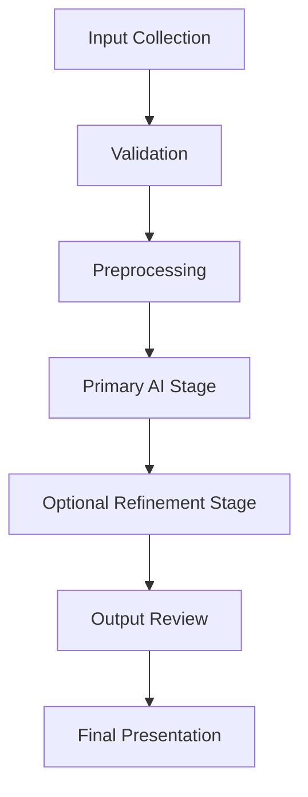

# Future Vision & Roadmap Specification

## 1. Future Vision Overview

FabricVision-AI is currently centered on a clear and focused purpose: enabling users to upload a person image and a fabric design image, express garment preferences, and receive a visually coherent garment generation and virtual try-on experience. The Future Ideas document exists to extend that purpose beyond the present implementation by capturing potential directions for evolution, research, and long-term growth. It is not intended to define immediate commitments, but to preserve a shared understanding of how the system might mature over time.

Documenting future possibilities is valuable because it helps the project remain intentional as it evolves. A strong future vision gives structure to design discussions, supports architectural flexibility, and ensures that new ideas are evaluated in relation to the broader purpose of the system. It also helps maintain continuity between the architectural foundation, the workflow definition, and the longer-term direction of the product.

The relationship between the three documents is important. Architecture describes the current structural principles and responsibilities of the system. Workflow describes how the system behaves as a sequence of logical stages. Future Ideas describes the potential avenues through which that architecture and workflow may grow in the future. Together, these documents provide a coherent and professional view of the project from present understanding to future possibility.

Long-term thinking is especially important in AI-powered applications because model capabilities, user expectations, and product requirements can change significantly over time. By documenting future possibilities in a structured way, FabricVision-AI can preserve flexibility without forcing premature implementation decisions. This allows the current system to remain stable while still being prepared for future improvements in realism, workflow depth, usability, and research potential.

> Vision Note: FabricVision-AI should evolve as a flexible, extensible, and research-informed platform for creative garment generation and virtual try-on, while preserving the clarity and modularity of its current foundation.

### 1.1 Vision Statement

FabricVision-AI aspires to become a highly adaptable and increasingly intelligent system for garment generation and virtual try-on, where future advances in AI, usability, and creative control can be integrated without compromising the clarity of its architectural foundation.

---

## 2. AI Model Evolution

The AI pipeline is one of the most important sources of future potential for FabricVision-AI. As model capabilities advance, the system may evolve from a focused garment-generation and try-on workflow into a richer and more realistic creative platform. The strongest future opportunities are likely to arise from modularity: if the architecture remains loosely coupled around distinct processing responsibilities, the underlying AI components can be improved or replaced without disrupting the broader experience.

### 2.1 Potential Directions in AI Advancement

Several future directions are conceptually relevant:

1. Improved garment generation models may produce more realistic garment silhouettes, better structural coherence, and enhanced visual fidelity.
2. Future diffusion-based or generative approaches may offer stronger control over style, texture, and garment appearance.
3. Better virtual try-on models may improve realism, pose adaptation, and the natural integration of garment and human figure.
4. Higher realism may emerge through improved detail preservation, better material representation, and more consistent lighting behavior.
5. Better texture preservation may allow fabric patterns and surface qualities to remain more faithful to the original design input.
6. Improved pose adaptation may help the generated garment align more naturally with the human subject in different postures and proportions.
7. More accurate garment fitting may lead to stronger visual consistency between the garment concept and the physical try-on result.
8. Improved fabric understanding may support more nuanced interpretation of materials, drape, and visual behavior.

### 2.2 Modular AI Replacement Strategy

A modular AI architecture is valuable because it allows each stage of the pipeline to evolve independently. In a system with distinct responsibilities, the garment generation stage and the try-on stage can be improved separately as new models become available. This makes it possible to adopt stronger generation models, more advanced try-on methods, or more specialized image-processing techniques without requiring a complete redesign of the system.

This approach also improves maintainability. When the model-specific logic is isolated from the rest of the application, the system becomes easier to evaluate, compare, and evolve. It also creates better opportunities for research experimentation because different AI approaches can be studied within a stable architectural framework.

### 2.3 Comparison of Current and Future AI Capabilities

| Current Capability | Potential Future Direction | Expected Value |
| --- | --- | --- |
| Basic garment generation from fabric input | More realistic and structurally coherent garment generation | Greater visual quality and trust in output |
| Virtual try-on based on a single transformation stage | More refined pose and fit adaptation | Better realism and stronger user satisfaction |
| Material and color influence through existing workflow | More nuanced material and texture interpretation | Improved fidelity to user intent |
| Focused AI pipeline with distinct stages | Modular replacement of individual AI services | Easier evolution and research experimentation |
| Current output centered on a single result | Multi-variant generation and model comparison | Greater creativity and user choice |

### 2.4 Future Observation

The future of FabricVision-AI is likely to depend heavily on how well its architecture supports continuous AI improvement without compromising conceptual clarity.

---

## 3. Expanded Garment Support

A natural area of future growth is the expansion of supported garment categories. The current workflow already supports a foundational garment-generation context, but the system could become more broadly useful if it were able to accommodate a wider variety of apparel forms and styling intentions.

### 3.1 Possible Future Garment Categories

Potential future directions may include support for categories such as:

- Shirts
- T-Shirts
- Dresses
- Hoodies
- Jackets
- Kurtas
- Blazers
- Traditional Wear
- Sportswear
- Children’s Wear

Each of these categories introduces different visual expectations, structure, and style requirements. Supporting a broader garment vocabulary would make the system more relevant to a wider range of users and use cases.

### 3.2 Why This Is Valuable

Expanding garment support improves the usefulness of the system in several ways:

1. It broadens the product’s creative range and user relevance.
2. It allows the system to respond to more diverse garment preferences.
3. It strengthens the connection between the user’s selection context and the generated output.
4. It creates future opportunities for more specialized representation of garment characteristics.

### 3.3 Architectural Considerations

From an architectural perspective, this expansion would benefit from a modular representation of garment categories. Rather than treating each garment type as an isolated special case, the system could evolve toward a more general model of garment intent, visual structure, and category-specific behavior. This would support maintainability and future extensibility while keeping the workflow conceptually consistent.

### 3.4 Future Observation

Broader garment support would not only increase the functional scope of the platform, but also make the system more adaptable to changing fashion and creative expectations.

---

## 4. Material, Pattern, and Color Expansion

The current workflow already includes material and color selection as part of the user-facing experience. In the future, these dimensions could become significantly richer and more expressive. This would improve the system’s ability to reflect nuanced design intent and expand its creative potential.

### 4.1 Possible Directions

Potential future directions include:

1. Additional fabric materials that better reflect the diversity of real-world textile types.
2. Richer color customization that allows users to express a broader palette of visual intent.
3. Pattern editing that enables more deliberate control over design structure and visual arrangement.
4. Texture enhancement to preserve or emphasize fabric surface qualities.
5. Material simulation to better communicate visual feel, weight, and drape.
6. Fabric appearance controls that help users refine the aesthetic outcome according to style preferences.

### 4.2 Why These Improvements Matter

These ideas are valuable because they increase the creative flexibility of the system while remaining aligned with the existing workflow. Users already provide material and color preferences as part of the experience; expanding these capabilities would make those inputs more expressive and more meaningful. From an architectural perspective, this creates the opportunity for richer generation logic without changing the overall interaction model.

### 4.3 User and Architectural Benefits

The benefits are both user-facing and structural:

- User benefit: greater control over garment appearance and style.
- Architectural benefit: a more expressive and configurable generation pipeline.
- Research benefit: improved understanding of material-specific and visual-style semantics.
- Maintainability benefit: clearer separation between user intent and model behavior.

### 4.4 Future Observation

Material, pattern, and color evolution would make the system more aligned with real creative design workflows, where visual nuance and expressive control are essential.

---

## 5. User Experience Enhancements

The user experience is central to the long-term value of FabricVision-AI. Even when the underlying AI capabilities improve, the system will remain more successful if users can interact with it clearly, comfortably, and confidently. Future work in this area should therefore focus on usability, clarity, and creative control rather than merely adding more features.

### 5.1 Possible User Experience Improvements

Potential future directions include:

1. Improved interface organization so that the input experience remains intuitive as the product grows.
2. Better image preview capabilities that help users assess their inputs before processing.
3. Side-by-side comparison views that allow users to compare different outcomes more easily.
4. Before-and-after comparison views that improve understanding of the transformation process.
5. Session reset or re-entry support that helps users begin new creative explorations without confusion.
6. Improved progress feedback that makes the workflow feel more transparent and predictable.
7. Responsive layouts that adapt more gracefully to different user contexts and display sizes.
8. Accessibility improvements that support a broader range of user needs.
9. Mobile-friendly interaction patterns that preserve clarity on smaller screens.

### 5.2 Why This Matters

A stronger user experience increases trust, reduce friction, and makes the system more approachable. From an architectural perspective, these improvements also encourage cleaner separation between presentation concerns and processing concerns. This helps preserve the modularity of the system while making the experience more effective.

### 5.3 Future Observation

User experience enhancements are not merely cosmetic; they can make the system more usable, more understandable, and more aligned with the creative intent of the user.

---

## 6. Image Processing Improvements

Image processing is a core enabler of reliable AI output. As the system evolves, future improvements in preprocessing are likely to have a strong impact on both quality and consistency. These enhancements would not replace the AI models, but would improve the quality of the data that enters the pipeline.

### 6.1 Potential Preprocessing Directions

Possible future directions include:

1. Better image quality enhancement for improved visual clarity.
2. Background refinement to reduce distractions and improve subject focus.
3. Automatic cropping to better isolate the relevant subject or garment region.
4. Automatic alignment to support more consistent input framing.
5. Better normalization to improve compatibility across different image sources.
6. Image quality analysis to estimate whether the input is suitable for downstream processing.
7. Input quality recommendations that guide the user toward stronger results.

### 6.2 Why These Improvements Are Important

Preprocessing improvements increase workflow reliability by helping the system work with higher-quality and more consistent inputs. They reduce the chance of poor results caused by weak image conditions and make the experience more predictable. This is especially important in creative AI systems, where small differences in input quality can significantly affect the final output.

### 6.3 Architectural Benefits

A more sophisticated preprocessing layer would strengthen the separation between input preparation and downstream AI reasoning. This helps create a cleaner pipeline where validation, quality assessment, and transformation are handled as distinct concerns rather than being conflated into model execution.

### 6.4 Future Observation

Better preprocessing would increase the overall intelligence of the workflow by ensuring that the system begins each generation cycle with stronger and more thoughtfully prepared inputs.

---

## 7. Workflow Evolution

The current workflow is intentionally simple and staged. Its strength lies in its clarity, but that clarity also creates an opportunity for future expansion. As the system evolves, the workflow could become more adaptive, more branching, and more intelligent while still preserving the modular design that supports maintainability.

### 7.1 Possible Workflow Extensions

Potential future directions include:

1. Additional preprocessing stages for more detailed preparation and refinement.
2. Multiple AI stages that enable more specialized generation and transformation steps.
3. Improved orchestration to coordinate more complex pipelines in a structured way.
4. Optional processing branches that allow different paths depending on the characteristics of the request.
5. More intelligent validation to assess quality and suitability earlier in the workflow.
6. Better output management to maintain and present intermediate or final artifacts more effectively.

### 7.2 Why Modular Workflow Design Matters

A modular workflow design supports long-term evolution because it allows new capabilities to be introduced as additional stages rather than as disruptive rewrites. This makes it easier to evolve the system gradually and to assign responsibilities more precisely as new requirements emerge. The architecture remains stable while the workflow becomes richer.

### 7.3 Workflow Evolution Diagram

### 7.4 Future Observation

The workflow should be able to grow in sophistication over time without losing its conceptual clarity or its ability to support future AI experimentation.

---

## 8. Output & Visualization Improvements

The output experience is central to how users perceive the success of the system. In the future, the product could become more expressive not only by generating better results, but by presenting those results in richer and more informative ways.

### 8.1 Possible Output Enhancements

Potential future directions include:

1. Multiple output variations generated from a single request to provide user choice.
2. Higher-resolution outputs that improve visual detail and presentation quality.
3. Comparison views that show different interpretations of the same request.
4. Download format flexibility to support different visual or editorial needs.
5. Output history, conceptually organized to help users revisit prior results.
6. Improved visualization quality to make the result easier to review and appreciate.

### 8.2 Why These Improvements Matter

These enhancements improve the overall user experience by making generated results more legible, more comparable, and more useful. They also support a more exploratory creative process, where users can evaluate multiple possibilities rather than receiving a single static outcome.

### 8.3 Architectural Benefits

Output improvements encourage the system to maintain a stronger separation between generation, presentation, and artifact management. This creates a more flexible experience layer that can grow independently of the core AI workflow.

### 8.4 Future Observation

The future value of FabricVision-AI will depend not only on generation quality, but also on how clearly and engagingly it presents the results.

---

## 9. Performance & Scalability Opportunities

As the system grows, performance and scalability will become increasingly important. While the project should remain implementation-independent in its documentation, it is still valuable to discuss architectural opportunities for improving efficiency and responsiveness over time.

### 9.1 Potential Opportunities

Possible future directions include:

1. Faster inference through more efficient orchestration and model handling.
2. Better memory utilization to support more complex image and workflow operations.
3. Improved workflow efficiency by reducing unnecessary processing steps.
4. Smarter resource management to prioritize the most relevant operations.
5. Parallel preprocessing where multiple preparation tasks can be handled independently.
6. Improved orchestration to make complex workflows more responsive and easier to reason about.

### 9.2 Why This Matters

Performance and scalability are not only technical concerns; they directly influence user satisfaction. A system that feels responsive and stable creates greater confidence, especially in creative applications where users may iterate frequently. From an architectural perspective, these improvements support a smoother transition from a prototype experience to a more mature and polished product.

### 9.3 Future Observation

Scalability in FabricVision-AI should be viewed as an architectural quality that enables continued growth in capability, workflow depth, and user demand without compromising clarity.

---

## 10. Research & Innovation Opportunities

FabricVision-AI also has potential value as a research-oriented platform. Beyond its immediate application purpose, the project could support exploratory work in creative AI, fashion understanding, and multimodal interaction. These directions should be viewed as future opportunities rather than planned product commitments.

### 10.1 Possible Research Directions

Potential future research areas include:

1. Personalized garment recommendations based on user preference patterns.
2. Intelligent style suggestions that help guide garment selection and generation.
3. Fashion trend awareness as a way of connecting generated outputs to broader design context.
4. AI-assisted garment design that helps users explore more creative or culturally nuanced possibilities.
5. Fabric understanding research focused on interpreting texture, structure, and material characteristics more deeply.
6. Multi-modal AI improvements that integrate image, selection context, and creative style more effectively.

### 10.2 Why Research Potential Matters

These directions are valuable because they extend the project beyond a narrow utility role and position it as a platform for broader AI creativity and experimentation. They also strengthen the long-term relevance of the system, especially if future model and interaction innovations continue to advance the field.

### 10.3 Future Observation

The project’s long-term significance may come not only from its current use case, but from its capacity to support future research in visual generation, fashion understanding, and intelligent creative assistance.

---

## 11. Long-Term Architectural Evolution

The architectural foundation of FabricVision-AI is especially important because it intentionally supports future growth. The project is not designed around a single rigid workflow or a single model strategy. Instead, it is structured to preserve separation of responsibilities, encourage modularity, and allow future enhancements to be introduced in a controlled and understandable way.

### 11.1 Architectural Evolution Principles

The long-term architectural vision is based on the following ideas:

1. Module replacement should be possible without rewriting the entire system.
2. AI model replacement should be feasible as new generation or try-on techniques emerge.
3. Workflow evolution should remain manageable as new processing stages are introduced.
4. Separation of responsibilities should continue to reduce architectural complexity.
5. Documentation should continue to grow alongside system sophistication.
6. Maintainability should remain a central design concern as the project expands.

### 11.2 Why the Current Architecture Matters

The current architecture is valuable precisely because it is not over-specialized. It provides a stable conceptual structure that can absorb future improvements in user experience, AI capability, workflow depth, and output sophistication. This flexibility is one of the system’s greatest strengths and should remain an explicit design goal as the project develops.

### 11.3 Architectural Expansion Diagram

### 11.4 Future Observation

The architecture should continue to evolve as an enabler of possibility rather than a constraint on innovation.

---

## 12. Future Vision Summary

FabricVision-AI has the potential to grow from a focused garment-generation and virtual try-on experience into a broader, more intelligent, and more expressive platform for creative visual interaction. Its future is likely to be shaped by advances in AI realism, richer garment and material support, more thoughtful user experience design, stronger preprocessing capabilities, more adaptive workflow orchestration, and deeper research into fashion-oriented AI.

The long-term vision is not simply to add more features, but to build a system that remains flexible, maintainable, and conceptually clear while expanding in capability. The ideas described in this document are intended as future directions rather than committed implementation plans. They represent possible paths of evolution that could strengthen the product’s quality, usefulness, creativity, and architectural maturity over time.

In this sense, the future of FabricVision-AI lies not only in better outputs, but in a stronger foundation for continued innovation. By preserving modularity, supporting research-oriented evolution, and remaining open to new forms of interaction and AI capability, the project can grow in a sustainable and purposeful way.

This specification therefore serves as a professional statement of future possibility: a guide for thoughtful evolution rather than a declaration of immediate delivery.
