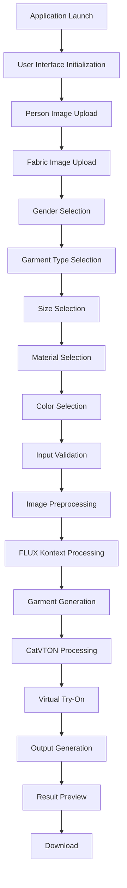
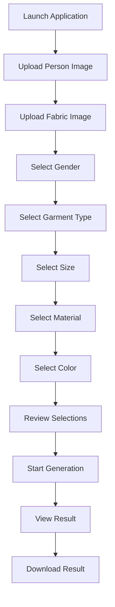
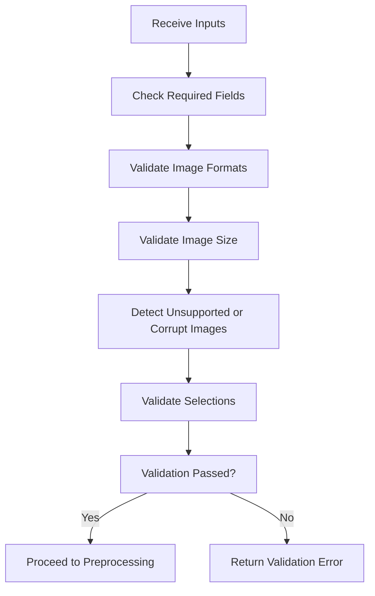
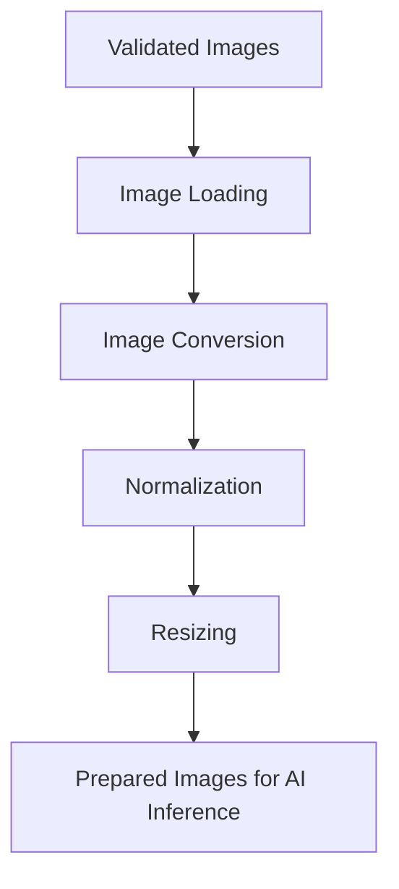
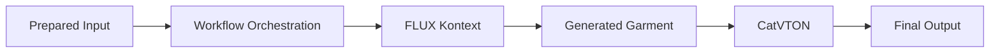
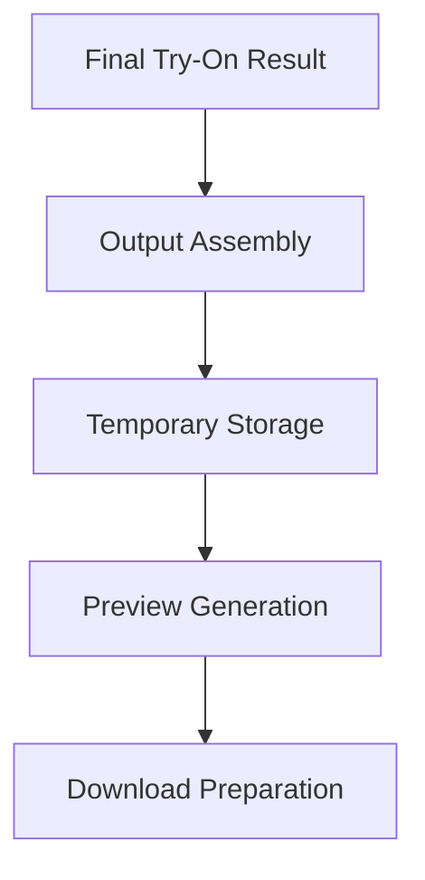
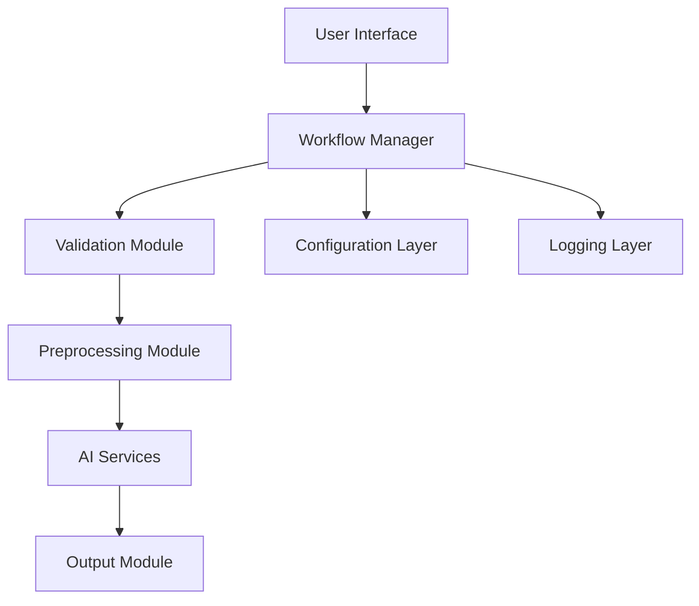
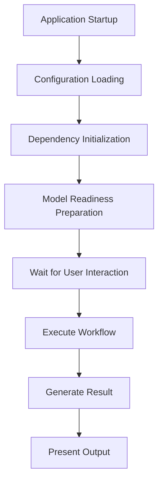
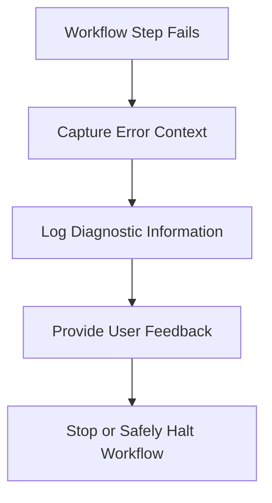
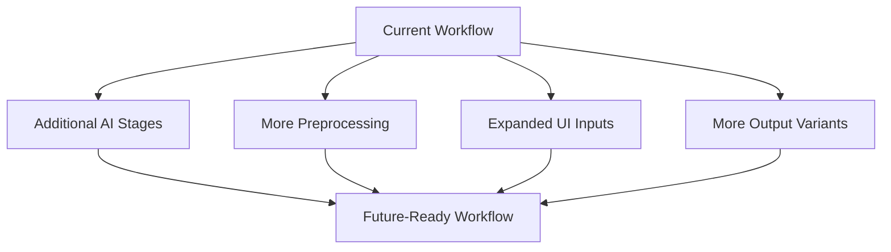

# Workflow

## 1. Workflow Overview

The workflow specification for FabricVision-AI defines the logical execution path of the application from initial launch to final output delivery. Its purpose is to provide a structured understanding of how user actions, input data, validation steps, preprocessing, AI processing, and result presentation fit together into a coherent system. A well-defined workflow is essential in an AI application because the success of the final result depends not only on the quality of the models, but also on the consistency and clarity of the stages that prepare and transform the input data.

This workflow specification serves several important architectural purposes. It explains how the system behaves from a user’s perspective, how the application processes requests, how responsibilities are distributed across the system, and how the overall design supports maintainability, debugging, and future growth. By documenting the workflow in a structured way, the project becomes easier to understand, review, and evolve over time.

The workflow also establishes a clear relationship between the software architecture and the application’s runtime behavior. Architecture describes the structural principles and component responsibilities, while workflow describes how those responsibilities are executed over time. Together, they form a complete view of the system that is useful for developers, reviewers, and future contributors.

### 1.1 Why Workflow Documentation Matters

Documenting the workflow provides several architectural benefits:

- It clarifies the sequence of operations that the application follows.
- It improves collaboration by giving all contributors a shared understanding of the process.
- It helps developers identify where failures or bottlenecks may occur.
- It supports maintainability by making the system easier to reason about and evolve.
- It strengthens future development by establishing a stable conceptual model for enhancements.

### 1.2 Workflow Objectives

The workflow specification for FabricVision-AI is intended to explain the following:

- How the application begins and progresses from launch to result generation.
- How user input is collected and transformed into processing-ready data.
- How validation and preprocessing ensure the reliability of the pipeline.
- How the AI stages are coordinated to produce the final garment and try-on result.
- How results are prepared for preview and download.

This document focuses on logical workflow behavior rather than implementation specifics, ensuring that it remains adaptable as the system evolves.

## 2. End-to-End Application Workflow

The end-to-end application workflow begins when the user launches the application and ends when the final output is previewed and prepared for download. This workflow is organized as a sequence of stages, each responsible for a distinct part of the application lifecycle. The purpose of this structure is to preserve clarity and make each stage understandable in isolation while also showing how the stages connect into a unified process.

### 2.1 High-Level Workflow Stages

The application lifecycle can be understood through the following stages:

1. Application Launch
2. User Interface Initialization
3. Person Image Upload
4. Fabric Image Upload
5. Gender Selection
6. Garment Type Selection
7. Size Selection
8. Material Selection
9. Color Selection
10. Input Validation
11. Image Preprocessing
12. FLUX Kontext Processing
13. Garment Generation
14. CatVTON Processing
15. Virtual Try-On
16. Output Generation
17. Result Preview
18. Download

### 2.2 Workflow Description

#### 2.2.1 Application Launch

The workflow begins when the application is launched. At this stage, the system becomes available to the user and prepares the environment for interaction. The purpose of this stage is to establish the application’s readiness so that the user can begin providing input and triggering the workflow.

#### 2.2.2 User Interface Initialization

Once the application is launched, the interface is initialized so that users can provide the required inputs and review the generated output. This stage creates the interaction context for the rest of the workflow and establishes the entry point for user-driven processing.

#### 2.2.3 Person Image Upload

The user uploads a person image that will be used as the visual basis for the try-on workflow. This input is essential because the final result must be composed around the subject represented by the uploaded image.

#### 2.2.4 Fabric Image Upload

The user uploads a fabric image that provides the design source for the garment generation stage. This input influences the visual characteristics of the generated garment and plays a central role in the AI workflow.

#### 2.2.5 Gender Selection

The user selects the gender category associated with the intended garment. This input helps guide the garment generation and selection logic, ensuring that the output aligns with the requested form of apparel.

#### 2.2.6 Garment Type Selection

The user specifies the desired garment type. This determines the intended kind of clothing that the system should generate, such as a shirt, top, dress, or other supported category.

#### 2.2.7 Size Selection

The user selects a garment size. This input contributes to the design context and informs the logical expectations of the output generation stage.

#### 2.2.8 Material Selection

The user selects the desired fabric material. This influences how the garment generation stage interprets the fabric image and how the output should reflect material characteristics.

#### 2.2.9 Color Selection

The user selects the garment color. This provides additional stylistic context for the generated output and contributes to the overall visual expression of the final garment.

#### 2.2.10 Input Validation

After the required inputs have been collected, the workflow enters validation. This stage checks whether the provided information is complete and suitable for processing. It protects the downstream workflow from invalid, incomplete, or malformed input.

#### 2.2.11 Image Preprocessing

Validated images are then prepared for AI inference. This stage standardizes the input data so that it can be consumed consistently by the processing stages that follow.

#### 2.2.12 FLUX Kontext Processing

The FLUX Kontext stage handles garment generation based on the uploaded fabric image and the selected garment characteristics. This stage is dedicated to creating a garment representation that preserves the fabric design intent while aligning with the requested garment category.

#### 2.2.13 Garment Generation

The result of the FLUX Kontext stage is the generated garment image. This acts as an intermediate artifact that carries the garment concept forward into the next stage of the workflow.

#### 2.2.14 CatVTON Processing

The CatVTON stage receives the generated garment and applies it to the uploaded person image. This stage is responsible for the virtual try-on rendering portion of the workflow.

#### 2.2.15 Virtual Try-On

The virtual try-on stage produces the final visual result in which the generated garment is placed onto the person image. This is the main outcome of the application workflow and represents the system’s core purpose.

#### 2.2.16 Output Generation

Once the try-on result is produced, the workflow creates the final output artifact in a form suitable for preview and distribution. This stage ensures that the generated result is available in a structured and consistent way.

#### 2.2.17 Result Preview

The generated output is presented to the user through the interface so that it can be reviewed. This stage provides the visible completion point of the workflow and confirms that the system has produced a usable result.

#### 2.2.18 Download

The final stage allows the user to obtain the generated output as a downloadable artifact. This provides the completed result in a portable form for use outside the application.

### 2.3 End-to-End Workflow Diagram

### 2.4 Workflow Summary

The end-to-end workflow of FabricVision-AI is a staged process that begins with user interaction and culminates in a downloadable virtual try-on result. Each stage has a defined purpose and contributes to the overall reliability, clarity, and extensibility of the application.

## 3. User Interaction Workflow

The user interaction workflow describes how a user engages with FabricVision-AI from the moment the application is launched to the moment the output is reviewed and downloaded. This workflow is important because it defines the user experience in a structured way and ensures that all user actions map cleanly to the underlying processing stages.

### 3.1 Interaction Flow

The interaction workflow follows a predictable sequence:

1. The user launches the application.
2. The user uploads a person image.
3. The user uploads a fabric image.
4. The user selects gender, garment type, size, material, and color.
5. The user reviews the selections and initiates generation.
6. The system processes the request and displays the result.
7. The user reviews the result and downloads it.

### 3.2 User Responsibilities

The user is responsible for providing the core inputs that define the request. These include the subject image, the fabric design image, and the garment preferences used to guide the AI generation process. The user is not responsible for the internal workflow logic; instead, the system manages the transformation from those inputs into the final output.

### 3.3 Why a Structured User Workflow Matters

A structured user workflow improves usability because it keeps the experience predictable, reduces ambiguity, and makes the progression from input to result easier to understand. It also supports consistency across sessions and makes the application easier to maintain as its interface evolves.

### 3.4 User Interaction Diagram

## 4. User Input Workflow

The user input workflow defines the logical purpose and role of each input supplied by the user. These inputs are the foundation of the application because they guide the AI processing stages and determine the character of the final output.

### 4.1 Person Image

The person image is the visual subject onto which the generated garment will be applied. Its purpose is to provide the human figure that anchors the virtual try-on result. It is expected to be a valid image that can be processed consistently by the workflow. Validation is required to ensure that the image is usable and not corrupted or unsupported. In the AI pipeline, it is passed into the try-on stage where the garment is fitted onto the person.

### 4.2 Fabric Image

The fabric image provides the visual pattern and material context for the garment generation process. Its purpose is to inform the system about the look and texture that should be preserved in the generated garment. The expected behavior is that the garment generation stage uses this image as a design source while maintaining the requested garment category. Validation is necessary to ensure that the image is usable and compatible with the downstream workflow. In the AI pipeline, it is a core input to the FLUX Kontext stage.

### 4.3 Gender

Gender is a selection input that helps define the context of the garment to be generated. Its purpose is to guide the logical garment expectation and support the correct garment category mapping. It is expected to be a valid choice from the supported options. Validation is required to ensure the input is recognized by the workflow. In the AI pipeline, it contributes to the generation context and helps shape the final garment design.

### 4.4 Garment Type

Garment type specifies the category of clothing the user wants generated. Its purpose is to direct the AI generation stage toward the appropriate garment form. It is expected to be a recognized selection. Validation ensures that the selected type is supported and compatible with the current workflow. In the pipeline, it influences the garment generation process.

### 4.5 Size

Size provides the requested garment sizing context. Its purpose is to influence the garment design expectations for the generated output. It is expected to be a valid size option. Validation ensures that the selection is recognized and consistent with the workflow. In the AI pipeline, it contributes to the logical garment context and can influence downstream output expectations.

### 4.6 Material

Material specifies the fabric type or material category associated with the requested garment. Its purpose is to guide the appearance and identity of the generated garment. It is expected to be a valid supported material. Validation ensures that the input is recognized. In the AI pipeline, it contributes to the garment generation stage and helps preserve material characteristics in the output.

### 4.7 Color

Color defines the desired visual tone of the garment. Its purpose is to influence the final garment appearance. It is expected to be a valid supported color choice. Validation ensures that the selected color is recognized by the application. In the AI pipeline, it contributes to the garment generation context and affects the final output appearance.

### 4.8 Input Summary Table

| Input | Purpose | Expected Behavior | Validation Requirement | Role in AI Pipeline |
| --- | --- | --- | --- | --- |
| Person Image | Provides the subject for try-on | Must be a usable image | Must be present and valid | Input to CatVTON |
| Fabric Image | Provides design source for garment generation | Must be a usable image | Must be present and valid | Input to FLUX Kontext |
| Gender | Guides garment context | Must be a supported selection | Must be recognized | Influences generation context |
| Garment Type | Defines the garment category | Must be a supported selection | Must be recognized | Influences FLUX Kontext output |
| Size | Defines garment sizing context | Must be a supported selection | Must be recognized | Contributes to output context |
| Material | Defines fabric/material identity | Must be a supported selection | Must be recognized | Influences garment generation |
| Color | Defines visual garment tone | Must be a supported selection | Must be recognized | Influences garment appearance |

## 5. Input Validation Workflow

The input validation workflow ensures that the application receives usable, consistent, and meaningful information before the processing stages begin. Validation is essential because the quality of the final output depends heavily on the quality and integrity of the inputs. This workflow protects the system from incomplete, unsupported, or damaged data and improves the reliability of the AI processing stages.

### 5.1 Validation Objectives

The validation workflow exists to:

- Confirm that required inputs are provided.
- Ensure that image files are supported and readable.
- Prevent invalid selections from entering the system.
- Detect corrupted or malformed content early.
- Provide clear user feedback when a workflow cannot proceed.

### 5.2 Validation Stages

#### 5.2.1 Required Field Validation

The workflow checks whether all required user inputs have been provided. If a critical input is missing, the process should not proceed to later stages.

#### 5.2.2 Image Format Validation

The system validates the uploaded image files to ensure they are of an acceptable and supported format. This helps prevent unsupported content from entering the workflow.

#### 5.2.3 Image Size Validation

The workflow checks the size of uploaded images to ensure they are within reasonable expectations for the application. This protects the system from inefficient or inappropriate input handling.

#### 5.2.4 Unsupported Image Detection

Unsupported images are identified before AI processing begins so that the application can respond appropriately. This avoids unnecessary downstream processing and maintains workflow predictability.

#### 5.2.5 Corrupted Image Detection

Corrupted or unreadable images are detected during validation so that the process can stop safely and provide feedback to the user.

#### 5.2.6 Invalid Selections

The workflow verifies that selections such as gender, garment type, size, material, and color are valid and supported. Invalid selections should be handled in a controlled way rather than silently ignored.

#### 5.2.7 Color Validation

The selected color input is checked to ensure that it is recognized and appropriate for the workflow context.

#### 5.2.8 Material Validation

The selected material is checked to ensure that it is recognized and supported by the pipeline’s expectations.

#### 5.2.9 Graceful Failure

When validation fails, the workflow should fail gracefully by stopping the process clearly and reporting the issue in a user-understandable way.

#### 5.2.10 User Feedback

The validation workflow should provide clear feedback so the user understands what needs to be corrected before proceeding.

### 5.3 Why Validation Protects Workflow Reliability

Validation becomes a protective boundary between the user-facing experience and the AI processing stages. It prevents invalid data from downstream processing, reduces the chance of unexpected failures, and contributes to the stability and trustworthiness of the system.

### 5.4 Validation Flow Diagram

### 5.5 Validation Summary Table

| Validation Area | Purpose | Architectural Benefit |
| --- | --- | --- |
| Required Field Validation | Confirms required inputs exist | Prevents incomplete workflow execution |
| Image Format Validation | Ensures supported image types | Improves consistency and compatibility |
| Image Size Validation | Prevents oversized or problematic input | Supports controlled resource usage |
| Unsupported Image Detection | Rejects unsupported content early | Avoids downstream processing failures |
| Corrupted Image Detection | Detects unreadable files | Improves robustness and reliability |
| Invalid Selections | Ensures supported choices are used | Protects workflow logic from invalid state |
| Color Validation | Confirms color input is recognized | Improves predictable output generation |
| Material Validation | Confirms material input is recognized | Improves generation accuracy and consistency |
| Graceful Failure | Provides controlled error handling | Improves maintainability and user experience |

## 6. Image Preprocessing Workflow

The image preprocessing workflow prepares validated images for the AI stages that follow. Its purpose is to make the inputs more consistent, reliable, and suitable for AI processing. This stage exists because raw images are not necessarily in a form that can be consumed directly by the downstream workflow without standardization.

### 6.1 Purpose of Preprocessing

Preprocessing exists to:

- Load the uploaded images into the workflow.
- Convert them into a consistent representation.
- Normalize important image characteristics.
- Prepare the images for AI inference.
- Reduce inconsistencies that may affect model behavior.

### 6.2 Preprocessing Responsibilities

#### 6.2.1 Image Loading

The workflow loads the validated images so they can be transformed into a processing-ready form.

#### 6.2.2 Image Conversion

The images are converted into a consistent representation that is suitable for the downstream pipeline.

#### 6.2.3 Normalization

Normalization helps standardize image attributes so that the processing stages can reasonably interpret the input.

#### 6.2.4 Resizing

The images may be resized or adjusted to meet the expected processing expectations of the AI workflow.

#### 6.2.5 Preparation for AI Inference

The preprocessing stage transforms the images into the expected input shape for the AI processing stages.

#### 6.2.6 Temporary Processing

Preprocessing is often a temporary transformation stage that supports later AI execution without permanently altering the original user input.

### 6.3 Expected Outputs

The preprocessing workflow produces prepared image data that is suitable for the AI stages. The output is not the final result, but a standardized intermediate representation that can be consumed by the next workflow stages.

### 6.4 Architectural Benefits

Separating preprocessing from validation and AI execution improves clarity and maintainability. It allows the workflow to distinguish between whether data is acceptable and how that data should be prepared for processing.

### 6.5 Future Preprocessing Expansion

As the system grows, additional preprocessing stages may be added to improve image quality, consistency, or model compatibility. The modular layout of the workflow makes this possible without requiring a complete redesign of the system.

### 6.6 Preprocessing Workflow Diagram

## 7. AI Processing Workflow

The AI processing workflow is the core transformation stage of FabricVision-AI. It converts validated and preprocessed user input into a generated garment and then into a final virtual try-on output. This workflow is important because it represents the application’s central purpose: using AI models to produce a realistic and coherent clothing result from user-supplied input.

### 7.1 Why the AI Workflow Is Staged

Garment generation and virtual try-on address different objectives and therefore should remain conceptually separated. The first AI stage focuses on creating the garment representation from the fabric design input, while the second stage focuses on applying that garment to the human subject. This separation creates a clearer architectural model and improves maintainability, debugging, and future expansion.

### 7.2 AI Workflow Stages

#### 7.2.1 Input Collection

The AI workflow begins with the assembled input data, including the preprocessed images and the selected garment preferences. These inputs are passed to the workflow orchestration layer for further progression.

#### 7.2.2 Workflow Orchestration

The workflow orchestration layer manages the sequence of AI stages. It ensures that the data moves in the correct order and that the right inputs are passed to each model.

#### 7.2.3 FLUX Kontext

FLUX Kontext performs the garment-generation stage. It interprets the fabric design and garment-related selections to produce a garment image.

#### 7.2.4 Generated Garment

The generated garment image becomes an intermediate artifact that carries the design intent into the next stage.

#### 7.2.5 CatVTON

CatVTON takes the generated garment and the person image and performs the virtual try-on rendering.

#### 7.2.6 Final Output

The final output is the completed try-on visualization that can be previewed and downloaded.

### 7.3 Data Movement Between AI Models

Data moves between the AI models through an intermediate artifact: the generated garment. This creates a clear handoff between the design-generation stage and the rendering stage. The separation ensures that each model operates on data that matches its purpose and that the workflow remains understandable at each boundary.

### 7.4 Why Model Independence Improves Maintainability

Model independence improves maintainability because changes in one AI model do not necessarily require changes in the rest of the workflow. The system can evolve by replacing, upgrading, or refining one model while preserving the overall processing structure.

### 7.5 AI Pipeline Diagram

### 7.6 AI Workflow Summary Table

| Stage | Responsibility | Output |
| --- | --- | --- |
| Input Collection | Gather prepared images and selections | Processing-ready request |
| Workflow Orchestration | Coordinate stage order and data movement | Ordered execution flow |
| FLUX Kontext | Generate garment from fabric design | Garment image |
| Generated Garment | Provide intermediate garment artifact | Intermediate result |
| CatVTON | Apply garment to person image | Final try-on result |
| Final Output | Present completed result for preview and download | Deliverable output |

## 8. FLUX Kontext Workflow

FLUX Kontext is the garment-generation stage of the workflow. Its purpose is to produce a garment image that reflects the uploaded fabric design while aligning with the user’s selected garment description.

### 8.1 Purpose

FLUX Kontext exists to transform the fabric design input into a coherent garment representation. Its role is focused on design synthesis rather than final rendering.

### 8.2 Inputs

The workflow provides FLUX Kontext with the fabric image and the selected garment-related preferences such as garment type, material, size, and color. These inputs establish the design context for the generated garment.

### 8.3 Garment Parameters

The selected parameters guide the generation process and influence the visual characteristics of the garment. These parameters help the workflow express the intended style and category of the garment.

### 8.4 Material and Color

The material and color selections influence how the generated garment should interpret the visual design of the fabric image. They shape the garment’s material identity and overall appearance.

### 8.5 Prompt Interpretation

The garment generation stage interprets the user’s requested garment context and translates it into an image generation task. This is an architectural step that creates a meaningful bridge between user intent and AI generation.

### 8.6 Garment Generation

The stage produces a garment image that reflects the requested design and category. This output becomes the intermediate garment artifact passed into the next workflow stage.

### 8.7 Outputs

The output of FLUX Kontext is a generated garment image intended for downstream try-on processing.

### 8.8 Architectural Boundaries

FLUX Kontext remains responsible only for garment generation. It does not assume responsibility for human fitting, body preservation, or final composition. This keeps the stage focused and prevents it from becoming overloaded with responsibilities that belong to the next model.

### 8.9 Future Extensibility

The FLUX Kontext stage can evolve to support more garment categories, more sophisticated design interpretation, or additional style controls without requiring changes to the rest of the workflow architecture.

### 8.10 Why FLUX Remains Independent from CatVTON

FLUX remains independent from CatVTON because the two stages serve different purposes. One creates the garment, while the other applies it. Their separation preserves clarity, modularity, and future flexibility.

## 9. CatVTON Workflow

CatVTON is the virtual try-on stage of the workflow. Its purpose is to apply the generated garment to the person image and produce a realistic final visualization.

### 9.1 Purpose

CatVTON exists to perform the rendering step that places the generated garment on the person image. It focuses on fitting and composition rather than garment creation.

### 9.2 Inputs

CatVTON consumes the person image and the generated garment produced by FLUX Kontext. These two inputs together form the basis of the try-on result.

### 9.3 Alignment and Fitting

The workflow expects CatVTON to align the garment with the person image in a way that preserves the subject’s pose and body structure as much as possible. This is a core part of the try-on process.

### 9.4 Rendering

The rendering stage produces the final composed image in which the garment appears integrated with the person image.

### 9.5 Final Try-On Generation

The final output of this workflow is the completed virtual try-on result.

### 9.6 Outputs

The output of CatVTON is the final try-on image that is presented to the user.

### 9.7 Architectural Boundaries

CatVTON remains responsible for rendering the garment onto the person image. It should not be responsible for generating the garment concept itself, because that responsibility belongs to the earlier stage.

### 9.8 Future Extensibility

CatVTON can later support more advanced fitting behavior, more refined rendering quality, or additional output variations while preserving the same modular workflow structure.

### 9.9 Why CatVTON Operates Independently

CatVTON operates independently because the try-on task is conceptually distinct from garment generation. This architectural separation allows the workflow to evolve each stage without unnecessarily coupling them together.

## 10. Output Generation Workflow

The output generation workflow describes how the final result is produced, prepared, and made available to the user. This stage is important because it transforms the completed AI output into a deliverable artifact that can be previewed and downloaded.

### 10.1 Output Creation

The output generation workflow begins once the virtual try-on result has been produced. The final image becomes the main output artifact of the application lifecycle.

### 10.2 Rendering and Assembly

The workflow ensures that the final output is assembled in a coherent and consistent form. This step preserves the result as a complete artifact rather than a temporary intermediate state.

### 10.3 Temporary Storage

The generated result may be kept in a temporary or structured output location so that it can be reviewed and retrieved later. This supports organization and traceability.

### 10.4 Preview Generation

The output is prepared for presentation to the user in the interface. The preview stage makes the result visible and reviewable.

### 10.5 Download Preparation

The output is prepared for download so that the user can retain the result outside the application.

### 10.6 Expected Outputs

The output workflow produces a final try-on image that can be viewed and downloaded.

### 10.7 Future Enhancements

Future enhancements may include richer output organization or additional artifact variants, but the core workflow remains centered on producing a final, reviewable, downloadable result.

### 10.8 Output Workflow Diagram

## 11. Data Movement Workflow

The data movement workflow describes how information moves throughout FabricVision-AI. This is important because the application is not a single-step operation; rather, it is a sequence of stages in which data is collected, validated, transformed, and handed to the next stage. A structured data movement workflow improves modularity and makes the application easier to understand and maintain.

### 11.1 Data Movement Path

The logical path of data movement is as follows:

User
↓
User Interface
↓
Validation
↓
Preprocessing
↓
FLUX Kontext
↓
Generated Garment
↓
CatVTON
↓
Output Generation
↓
User

### 11.2 Why Structured Data Movement Matters

Structured data movement helps preserve clarity within the architecture. It ensures that each stage receives only the data it needs, that outputs are passed in a controlled manner, and that the system remains modular rather than tightly interconnected.

### 11.3 Data Flow Diagram

## 12. Module Interaction Workflow

The module interaction workflow describes how the logical software modules of FabricVision-AI cooperate during execution. This is important because the system is composed of several responsibilities that must work together without becoming tightly coupled.

### 12.1 Core Module Interactions

The key modules involved in the workflow are:

- User Interface
- Workflow Manager
- Validation Module
- Preprocessing Module
- AI Services
- Output Module
- Configuration Layer
- Logging Layer

### 12.2 Interaction Responsibilities

The User Interface collects inputs and presents results. The Workflow Manager coordinates the overall process. The Validation Module checks the quality and completeness of the inputs. The Preprocessing Module standardizes image data. The AI Services module performs the generation and try-on stages. The Output Module manages the final artifact. The Configuration Layer supports consistent runtime settings, and the Logging Layer records workflow activity for diagnostics.

### 12.3 Why Loose Coupling Improves Maintainability

Loose coupling improves maintainability because it allows modules to evolve and be tested independently. This reduces the risk of changes in one module causing breakage in another and supports future enhancements without major restructuring.

### 12.4 Module Interaction Diagram

## 13. Runtime Execution Workflow

The runtime execution workflow describes the application’s logical order of operations during a run. This view is useful because it shows how the application transitions from startup to completion while maintaining a coherent execution sequence.

### 13.1 Execution Sequence

The runtime execution workflow follows this general order:

1. Application startup.
2. Configuration loading.
3. Dependency initialization.
4. Model readiness preparation.
5. Waiting for user interaction.
6. Workflow execution after input submission.
7. Result generation.
8. Completion and output presentation.

### 13.2 Runtime Execution Diagram

## 14. Error Handling Workflow

The error handling workflow describes how the application responds when a stage cannot complete successfully. This is an essential part of the workflow specification because reliable AI systems need to respond predictably to invalid input, unsupported content, failed preprocessing, or processing interruptions.

### 14.1 Error Categories

The workflow may need to handle:

- Missing inputs
- Invalid files
- Unsupported formats
- Validation failures
- Preprocessing failures
- AI processing failures
- Output generation failures

### 14.2 Error Handling Principles

The application should handle errors gracefully by stopping or redirecting the workflow in a controlled way, providing feedback to the user, and recording diagnostic information for future review. This prevents the system from entering ambiguous or inconsistent states.

### 14.3 User Feedback and Diagnostics

When an error occurs, the workflow should provide clear and understandable feedback to the user while preserving the diagnostic information needed for debugging and maintainability.

### 14.4 Error Handling Diagram

### 14.5 Error Handling Summary Table

| Error Type | Handling Approach | Architectural Benefit |
| --- | --- | --- |
| Missing Inputs | Stop workflow and request completion | Prevents incomplete processing |
| Invalid Files | Reject and report clearly | Improves reliability |
| Unsupported Formats | Reject early with feedback | Prevents downstream failures |
| Validation Failures | Halt pipeline and report issue | Protects workflow integrity |
| Preprocessing Failures | Stop before AI processing | Limits wasted effort and confusion |
| AI Processing Failures | Report failure clearly | Supports diagnostics and future refinement |
| Output Generation Failures | Prevent incomplete result delivery | Preserves trust in the result flow |

## 15. Future Workflow Expansion

The workflow architecture of FabricVision-AI is designed to support long-term growth. Its modular and staged structure makes it suitable for additional garment categories, new materials, extra preprocessing stages, alternative AI models, and more advanced orchestration over time.

### 15.1 Expansion Areas

Potential future workflow expansion includes:

- Additional garment categories
- Additional materials
- Expanded color customization
- Additional preprocessing stages
- Additional AI models
- Improved workflow orchestration
- UI improvements
- Performance optimization
- Batch processing
- Future deployment possibilities

### 15.2 Why the Workflow Supports Growth

The workflow is extensible because it separates responsibilities into stages and keeps each stage focused on a specific purpose. This interdisciplinary structure allows the system to grow without forcing the entire lifecycle to be rewritten.

### 15.3 Evolution Diagram

### 15.4 Future Expansion Summary Table

| Expansion Area | Workflow Benefit |
| --- | --- |
| Additional Garment Categories | Broadens the system’s functional scope |
| Additional Materials | Improves design fidelity and variety |
| Expanded Color Customization | Supports richer user intent |
| Additional Preprocessing Stages | Improves input quality and consistency |
| Additional AI Models | Supports specialization and flexibility |
| Improved Workflow Orchestration | Enables more sophisticated processing logic |
| UI Improvements | Improves interaction and usability |
| Performance Optimization | Improves runtime efficiency |
| Batch Processing | Expands throughput potential |

## 16. Workflow Summary

FabricVision-AI follows a structured workflow that begins with application launch and continues through user interaction, input validation, image preprocessing, AI-based garment generation, virtual try-on rendering, output preparation, and final result delivery. Each stage exists to fulfill a specific architectural purpose and to ensure that the application behaves predictably and coherently from start to finish.

The workflow is designed to support a clear user journey, a reliable input lifecycle, and an orderly progression through validation, preprocessing, AI processing, data movement, module interaction, runtime execution, and error handling. The separation between garment generation and virtual try-on is particularly important because it preserves modularity and allows each model to focus on its own responsibility. The result is a workflow that is both understandable in its current form and extensible for future growth.

This specification provides a strong foundation for understanding the logical execution flow of FabricVision-AI and for supporting future development in a maintainable, scalable, and reliable way. It is therefore well suited to serve as the official System Workflow Specification for the project.
